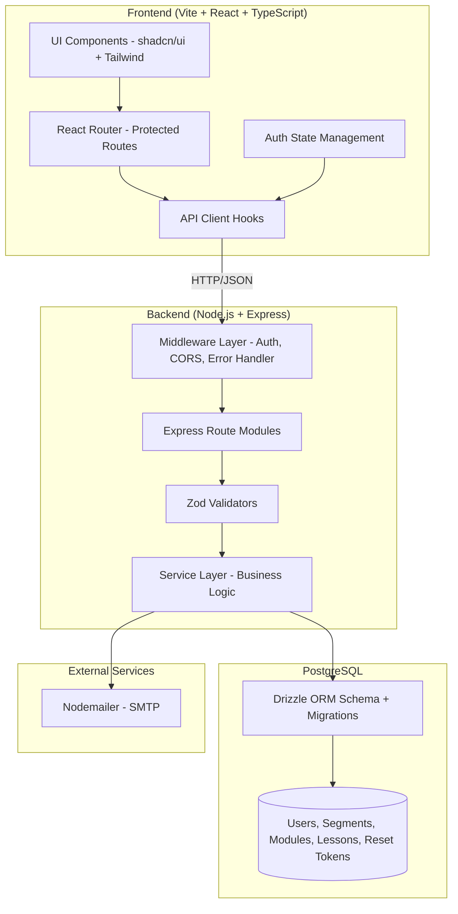
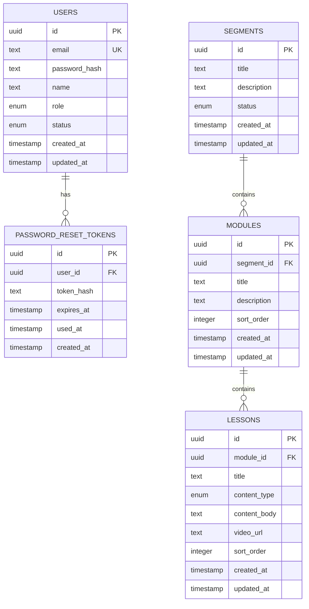

# Design Document

## Overview

This design covers Milestone 1 (M1) of the Rhose learning platform: Project Setup & Core Architecture. It establishes the monorepo structure, user authentication flows (login, forgot/reset password), user profile management, base data models (Users, Segments, Modules, Lessons), responsive layout scaffolding, consistent API error handling, and admin user creation.

The milestone delivers the foundational technical layer that all subsequent milestones build upon — without implementing content management, learning experiences, quizzes, or email scheduling.

### Relevant Tech Context

- Monorepo application.
- Frontend: Vite, React, TypeScript, shadcn/ui, Tailwind CSS.
- Backend: Node.js, Express, PostgreSQL, Drizzle ORM.
- Validation: Zod.
- Auth: email/password stored in DB with hashed passwords (bcrypt, cost factor 10).
- Emails: Nodemailer.

### Screenshot/Figma Context

Kiro must read `.kiro/context/screenshot-catalog.md` before generating or modifying UI for this milestone.

Relevant screenshot assets:
- `.kiro/context/screenshots/USER_PROFILE.webp`
- `.kiro/context/screenshots/MOBILE_VIEW.png`
- `.kiro/context/screenshots/STYLE.png`
- `.kiro/context/screenshots/OVERLAY.png`

### Screen and Flow Interpretation

M1 covers authentication, profile, base layout foundations, and core models.

Auth/profile screenshot interpretation:
- Desktop auth screens use a split layout: left teal visual panel, right form.
- Mobile auth screens use a single-column form with no teal side panel.
- Login includes email, password, remember me, navy Login button, Forgot Password link, and Contact your admin support link.
- Forgot Password includes email field and Send Email button.
- Reset/Set Password includes new password, confirm password, strength/rule helper, and disabled/enabled submit state.
- Profile page includes sidebar, cover image, avatar, role/job title text, Profile and Password tabs, editable fields, Cancel/Save/Edit actions, and logout on mobile.
- Base admin/learner layout shells must be created only enough to support future screens, not full dashboard behavior.

### Milestone UI/Figma Gaps and Clarifications

- Final brand/logo asset and exact auth illustration/teal-panel content should be confirmed from Figma assets.
- Exact password strength rules need confirmation if they differ from backend validation. Backend minimum should still remain enforceable through Zod.
- Contact admin link behavior is visible in UI but destination/content needs confirmation.
- Remember me behavior should be implemented only if token/session handling supports it; otherwise mark as pending.

## Architecture

### System Architecture



### Request Flow

1. Frontend makes HTTP request via API client hooks.
2. CORS middleware validates origin.
3. Auth middleware validates JWT (for protected routes).
4. Zod validator validates request payload.
5. Controller delegates to service layer.
6. Service executes business logic via Drizzle ORM.
7. Response formatted in consistent shape (`{ success, data }` or `{ success, error }`).

### Backend Design Notes

- Set up frontend routing and protected route boundaries.
- Set up backend app bootstrap, env config, DB connection, Drizzle schema foundation, and auth middleware.
- Create foundational models for users, segments, modules, and lessons.
- Implement login, forgot password, reset password, profile get/update, and password change.
- Keep layout shells minimal but visually aligned with screenshot catalog.

### Frontend Design Notes

- Use shared service/API client hooks for data access.
- Use reusable layout shells for admin and learner areas.
- Use shared components for Button, FormField, Select/Dropdown, StatusBadge, Card, ActionMenu, SuccessModal, Sidebar, ProgressBar, and SegmentAccordion.
- Keep loading, empty, disabled, and error states visually consistent with the screenshot catalog.
- Mobile screens must be intentionally designed as stacked cards/drawers, not compressed desktop tables.

### UI Implementation Instructions

- Keep the UI consistent with `.kiro/steering/ui-style-guide.md`, `.kiro/steering/design-system.md`, `.kiro/context/screenshot-catalog.md`, `STYLE.png`, and `OVERLAY.png`.
- Use shadcn/ui primitives where they match the screenshots, but centralize variants in shared components instead of scattering one-off Tailwind classes.
- Preserve the screenshot visual system: Inter typography, teal active states, navy primary actions, white cards, light borders, subtle shadows, rounded corners, status badges, and responsive 4-column/mobile and 12-column/desktop grids.
- Do not invent missing flows. If the SOW requires something not shown in screenshots, implement safe structure and mark the missing UI state as a gap.
- Treat screenshots as UI/UX references, not automatic scope additions.

## Components and Interfaces

### API Endpoints

#### Auth Module (`/api/auth`)

| Method | Path | Auth | Description |
|--------|------|------|-------------|
| POST | `/api/auth/login` | Public | Authenticate user, return JWT |
| POST | `/api/auth/forgot-password` | Public | Generate reset token, send email |
| POST | `/api/auth/reset-password` | Public | Validate token, update password |

#### Users Module (`/api/users`)

| Method | Path | Auth | Description |
|--------|------|------|-------------|
| GET | `/api/users/profile` | Authenticated | Get current user profile |
| PATCH | `/api/users/profile` | Authenticated | Update current user profile |
| POST | `/api/users/change-password` | Authenticated | Change current user password |
| POST | `/api/users` | Admin | Create new user account |

#### API Design Rules

- Use Express route modules by feature.
- Validate request bodies and params with Zod.
- Enforce authentication on protected routes.
- Enforce admin access on admin routes.
- Enforce learner assignment and segment access checks on learner routes.
- Use consistent response shapes and error codes.
- Keep controllers thin and business logic in services.

### Backend Service Interfaces

```typescript
// Auth Service
interface AuthService {
  login(email: string, password: string): Promise<{ token: string; user: UserProfile }>;
  forgotPassword(email: string): Promise<void>;
  resetPassword(token: string, newPassword: string): Promise<void>;
  verifyToken(token: string): Promise<JwtPayload>;
}

// User Service
interface UserService {
  getProfile(userId: string): Promise<UserProfile>;
  updateProfile(userId: string, data: UpdateProfileDto): Promise<UserProfile>;
  changePassword(userId: string, currentPassword: string, newPassword: string): Promise<void>;
  createUser(data: CreateUserDto): Promise<UserProfile>;
}

// Password Hasher
interface PasswordHasher {
  hash(plaintext: string): Promise<string>;
  verify(plaintext: string, hash: string): Promise<boolean>;
}

// Token Generator
interface TokenGenerator {
  generate(): string; // min 32 bytes cryptographic randomness
  hashToken(token: string): string;
}
```

### Frontend Components

#### Layout Components
- `AdminLayout` — Sidebar + main content area for admin pages
- `LearnerLayout` — Sidebar + main content area for learner pages
- `AuthLayout` — Split layout (desktop: teal panel + form, mobile: form only)

#### Auth Pages
- `LoginPage` — Email/password form, remember me, forgot password link
- `ForgotPasswordPage` — Email field, send email button
- `ResetPasswordPage` — New password, confirm, strength indicator

#### Profile Pages
- `ProfilePage` — Profile and Password tabs, editable fields, avatar/cover

#### Shared UI Components
- `Button` — Navy primary, teal secondary, outline, destructive variants
- `FormField` — Input with label, error state, helper text
- `Select/Dropdown` — White card, subtle shadow, selected state
- `StatusBadge` — Not Started, In Progress, Completed, etc.
- `Card` — White surface, rounded corners, subtle shadow
- `Sidebar` — Persistent (desktop) / collapsible (mobile)

### Frontend Design Rules

- Use shared service/API client hooks for data access.
- Use reusable layout shells for admin and learner areas.
- Keep loading, empty, disabled, and error states visually consistent with the screenshot catalog.
- Mobile screens must be intentionally designed as stacked cards/drawers, not compressed desktop tables.

## Data Models

Kiro should update or create Drizzle schema definitions only where required by this milestone. Only add tables needed for this milestone. Do not overbuild future milestone models unless required as a dependency.

### Users Table

```typescript
export const users = pgTable('users', {
  id: uuid('id').primaryKey().defaultRandom(),
  email: text('email').notNull().unique(),
  passwordHash: text('password_hash').notNull(),
  name: text('name').notNull(),
  role: pgEnum('user_role', ['admin', 'learner']).notNull(),
  status: pgEnum('user_status', ['active', 'inactive', 'deactivated']).notNull().default('active'),
  createdAt: timestamp('created_at').defaultNow().notNull(),
  updatedAt: timestamp('updated_at').defaultNow().notNull(),
});
```

### Password Reset Tokens Table

```typescript
export const passwordResetTokens = pgTable('password_reset_tokens', {
  id: uuid('id').primaryKey().defaultRandom(),
  userId: uuid('user_id').references(() => users.id).notNull(),
  tokenHash: text('token_hash').notNull(),
  expiresAt: timestamp('expires_at').notNull(),
  usedAt: timestamp('used_at'),
  createdAt: timestamp('created_at').defaultNow().notNull(),
});
```

### Segments Table

```typescript
export const segments = pgTable('segments', {
  id: uuid('id').primaryKey().defaultRandom(),
  title: text('title').notNull(),
  description: text('description'),
  status: pgEnum('segment_status', ['draft', 'active', 'archived']).notNull().default('draft'),
  createdAt: timestamp('created_at').defaultNow().notNull(),
  updatedAt: timestamp('updated_at').defaultNow().notNull(),
});
```

### Modules Table

```typescript
export const modules = pgTable('modules', {
  id: uuid('id').primaryKey().defaultRandom(),
  segmentId: uuid('segment_id').references(() => segments.id).notNull(),
  title: text('title').notNull(),
  description: text('description'),
  sortOrder: integer('sort_order').notNull().default(0),
  createdAt: timestamp('created_at').defaultNow().notNull(),
  updatedAt: timestamp('updated_at').defaultNow().notNull(),
});
```

### Lessons Table

```typescript
export const lessons = pgTable('lessons', {
  id: uuid('id').primaryKey().defaultRandom(),
  moduleId: uuid('module_id').references(() => modules.id).notNull(),
  title: text('title').notNull(),
  contentType: pgEnum('lesson_content_type', ['text', 'video']).notNull(),
  contentBody: text('content_body'),
  videoUrl: text('video_url'),
  sortOrder: integer('sort_order').notNull().default(0),
  createdAt: timestamp('created_at').defaultNow().notNull(),
  updatedAt: timestamp('updated_at').defaultNow().notNull(),
});
```

### Entity Relationship Diagram



### Data Model Scope Notes

General entities that may be involved in future milestones (not built now):
- segment assignments
- lesson progress
- quizzes, quiz questions, quiz options, quiz responses
- email schedules/logs

Only add tables needed for this milestone. Do not overbuild future milestone models unless required as a dependency.

## Correctness Properties

*A property is a characteristic or behavior that should hold true across all valid executions of a system — essentially, a formal statement about what the system should do. Properties serve as the bridge between human-readable specifications and machine-verifiable correctness guarantees.*

### Property 1: Password Hash Round-Trip

*For any* plaintext password string, hashing it with bcrypt and then verifying the same plaintext against the resulting hash SHALL return true.

**Validates: Requirements 4.3**

### Property 2: Distinct Passwords Produce Distinct Hashes

*For any* two distinct plaintext password strings, hashing both SHALL produce different hash outputs.

**Validates: Requirements 4.4**

### Property 3: Valid Login Returns JWT with Role

*For any* user with a valid email/password stored in the database, submitting those credentials to the login endpoint SHALL return a signed JWT containing the user's id and role.

**Validates: Requirements 2.1, 2.6**

### Property 4: Invalid JWT is Rejected

*For any* malformed string or expired JWT token, the auth middleware SHALL reject the request with a 401 response, and for any valid JWT the middleware SHALL grant access.

**Validates: Requirements 2.7, 2.8**

### Property 5: Validation Rejects Invalid Payloads

*For any* request payload that violates the Zod schema for a given endpoint (missing required fields, invalid formats, values below minimum length), the Schema_Validator SHALL return a 400 response with field-specific error details.

**Validates: Requirements 2.4, 2.5, 3.6, 5.7, 9.4**

### Property 6: Password Reset Round-Trip

*For any* valid reset token and new password meeting minimum requirements, submitting the reset SHALL update the stored password (new password works for login) and invalidate the token (reuse returns error).

**Validates: Requirements 3.3**

### Property 7: Reset Token Cryptographic Strength

*For any* generated reset token, the token SHALL contain at least 32 bytes of cryptographic randomness.

**Validates: Requirements 3.7**

### Property 8: Profile Update Round-Trip

*For any* authenticated user and valid profile update payload, submitting the update and then fetching the profile SHALL return the updated values.

**Validates: Requirements 5.2**

### Property 9: Password Change Round-Trip

*For any* authenticated user with a known current password and a valid new password, changing the password SHALL allow login with the new password and reject login with the old password.

**Validates: Requirements 5.4**

### Property 10: No Password Hash in API Responses

*For any* API endpoint that returns user data (profile, user creation, user list), the response payload SHALL never contain the `password_hash` field.

**Validates: Requirements 4.5, 5.1, 9.1**

### Property 11: API Response Shape Consistency

*For any* API response from the backend, success responses SHALL match `{ success: true, data: object }` and error responses SHALL match `{ success: false, error: { code: string, message: string, details?: object } }` without exposing stack traces or internal details.

**Validates: Requirements 8.1, 8.2, 8.7**

### Property 12: CORS Headers on All Endpoints

*For any* API request to any endpoint, the response SHALL include appropriate CORS headers for the configured frontend origin.

**Validates: Requirements 8.8**

### Property 13: User Creation Stores Correct Status and Role

*For any* valid user creation request submitted by an admin, the created user record SHALL have status "active" and the role specified in the request, and the API response SHALL exclude the password hash.

**Validates: Requirements 9.1, 9.5**

### Property 14: Schema Migration Round-Trip

*For all* Drizzle schema definitions, running migrations against an empty database and then introspecting the resulting tables SHALL produce structures matching the schema definitions (columns, types, constraints).

**Validates: Requirements 6.8**

## Error Handling

### API Error Response Strategy

All errors follow a consistent shape:

```typescript
// Error response
{
  success: false,
  error: {
    code: string,       // Machine-readable error code
    message: string,    // Human-readable message
    details?: object    // Optional field-specific details (validation errors)
  }
}

// Success response
{
  success: true,
  data: object
}
```

### Error Code Mapping

| HTTP Status | Error Code | Trigger |
|-------------|-----------|---------|
| 400 | `VALIDATION_ERROR` | Zod schema validation failure |
| 401 | `UNAUTHORIZED` | Missing/invalid/expired JWT, invalid credentials |
| 403 | `FORBIDDEN` | Authenticated user lacks required role |
| 404 | `NOT_FOUND` | Requested resource does not exist |
| 409 | `CONFLICT` | Duplicate email on user creation or profile update |
| 500 | `INTERNAL_ERROR` | Unhandled server error (no stack trace exposed) |

### Error Handling Middleware

- Global error handler catches unhandled exceptions and formats them as `INTERNAL_ERROR`.
- Zod validation errors are caught and formatted with field-specific details.
- JWT errors (expired, malformed) are caught by auth middleware and returned as `UNAUTHORIZED`.
- All error responses omit stack traces, internal paths, and sensitive data in production.

### Security Error Handling

- Login with non-existent email returns same 401 as wrong password (no email enumeration).
- Forgot password with unregistered email returns 200 (no email enumeration).
- Password hashes are never included in any response.
- JWT secrets and database credentials are never exposed in error details.

### Frontend Error Handling

- API client hooks parse error responses and surface field-specific validation errors on forms.
- Network errors and 500s display a generic "Something went wrong" message.
- 401 responses trigger redirect to login page and clear auth state.
- Loading, empty, disabled, and error states are visually consistent with the screenshot catalog.

## Testing Strategy

### Unit Tests

Unit tests cover specific examples, edge cases, and error conditions:

- **Auth Service**: Login with valid/invalid credentials, token generation, password reset flow edge cases (expired token, used token, unregistered email).
- **Password Hasher**: Bcrypt cost factor verification, plaintext never stored.
- **Zod Validators**: Specific invalid payloads for each endpoint schema.
- **Middleware**: Auth middleware with valid/invalid/expired tokens, error handler formatting.
- **User Service**: Profile CRUD, duplicate email conflict, admin-only access.
- **Frontend Components**: Render tests for auth forms, layout shell at different viewports, role-based navigation.

### Property-Based Tests

Property-based tests verify universal properties across randomized inputs. Each property test runs a minimum of 100 iterations.

**Library**: [fast-check](https://github.com/dubzzz/fast-check) (TypeScript PBT library)

**Configuration**: Minimum 100 iterations per property, tagged with design property reference.

**Tag format**: `Feature: m1-project-setup-core-architecture, Property {number}: {title}`

Properties to implement:
1. Password hash round-trip (Property 1)
2. Distinct passwords produce distinct hashes (Property 2)
3. Valid login returns JWT with role (Property 3)
4. Invalid JWT is rejected (Property 4)
5. Validation rejects invalid payloads (Property 5)
6. Password reset round-trip (Property 6)
7. Reset token cryptographic strength (Property 7)
8. Profile update round-trip (Property 8)
9. Password change round-trip (Property 9)
10. No password hash in API responses (Property 10)
11. API response shape consistency (Property 11)
12. CORS headers on all endpoints (Property 12)
13. User creation stores correct status/role (Property 13)
14. Schema migration round-trip (Property 14)

### Integration Tests

Integration tests verify external service wiring and database behavior with 1-3 representative examples:

- **Database**: FK constraint violations (Module → Segment, Lesson → Module), migration against empty DB.
- **Email**: Nodemailer sends reset email (mock SMTP in test).
- **Full Auth Flow**: Login → access protected route → token expiry → re-login.

### Smoke Tests

Single-execution checks for configuration and setup:

- Monorepo workspace structure exists with correct dependencies.
- Environment configuration files present with documented variables.
- Dev server starts both frontend and backend.
- Database migrations run without errors.
- Tailwind config includes required color tokens and Inter font.

### Test Organization

```
backend/
  src/
    modules/
      auth/__tests__/
        auth.service.spec.ts        # Unit tests
        auth.properties.spec.ts     # Property-based tests
      users/__tests__/
        users.service.spec.ts
        users.properties.spec.ts
    middleware/__tests__/
      auth.middleware.spec.ts
      error-handler.spec.ts
    __tests__/
      integration/
        auth-flow.integration.spec.ts
        db-constraints.integration.spec.ts

frontend/
  src/
    features/auth/__tests__/
      LoginPage.spec.tsx
      ForgotPasswordPage.spec.tsx
    components/layout/__tests__/
      AdminLayout.spec.tsx
      LearnerLayout.spec.tsx
```
