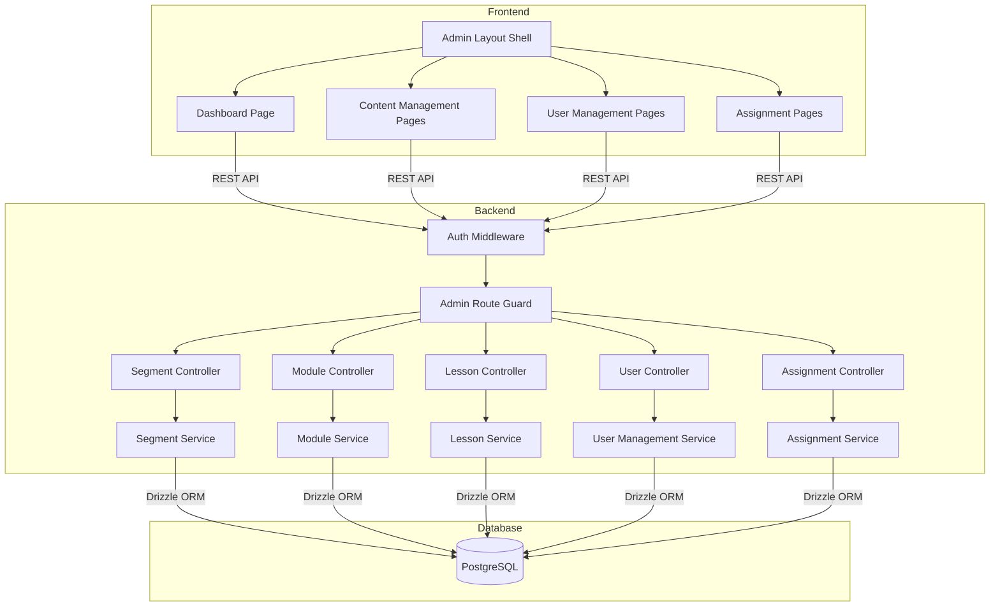

# Design Document

## Overview

This design defines the implementation approach for Milestone 2: Admin Content Management. M2 enables admins to create and manage learning content (Segments, Modules, Lessons), manage user accounts, and assign users to segments through a dedicated admin interface built on the M1 foundation (authentication, data models, layout shell).

### Purpose

The design covers admin dashboard, content management (CRUD with status lifecycle), user management, and segment assignment — with the uploaded screenshot/Figma context converted into text so Kiro can use it even when image reading fails.

### Relevant Tech Context

- Monorepo application.
- Frontend: Vite, React, TypeScript, shadcn/ui, Tailwind CSS.
- Backend: Node.js, Express, PostgreSQL, Drizzle ORM.
- Validation: Zod.
- Auth: email/password stored in DB with hashed passwords.
- Emails: Nodemailer.

### Screenshot/Figma Context To Use

Kiro must read `.kiro/context/screenshot-catalog.md` before generating or modifying UI for this milestone.

Relevant screenshot assets:
- `.kiro/context/screenshots/DASHBOARD_SCREEN.png`
- `.kiro/context/screenshots/CONTENT_MANAGEMENT.png`
- `.kiro/context/screenshots/USER_MANAGMENT_SCREENS.png`
- `.kiro/context/screenshots/COMPONENTS.png`
- `.kiro/context/screenshots/STYLE.png`
- `.kiro/context/screenshots/OVERLAY.png`

### Screen and Flow Interpretation

M2 covers admin dashboard, content management, user management, and segment assignment.

**Admin dashboard:**
- Use left sidebar with active teal item and bottom Settings/Log out.
- Header includes greeting, Dashboard title, profile dropdown.
- Quick actions: Assign Segment, Create User, Add New Segment.
- Stats cards: Total Users, Active Segment, Total Modules, Total Lessons.
- Segment Overview list uses status badges, progress bars, filter/status dropdown.
- Recent Activity panel is a lightweight UI pattern only; do not turn it into advanced analytics.

**Content management:**
- Use table/list view with row action menu.
- Create Segment uses a stepper/wizard with segment info, modules, lessons, quiz/questions, and review/details.
- Add Module, Add Lesson, and Add Question use right-side drawer/panel patterns.
- Segment Details summarizes info, modules/lessons/quiz, assigned users, and progress.

**User management:**
- User list has search, filter dropdown, columns for role/job title, assigned segment, progress, status, and actions.
- Row actions: View Profile, Assign Segment, Reset Password, Deactivate User.
- Create User form includes user info, role/job-title dropdown, segment assignment, invite email action, and success modal.
- User Profile admin view includes user details, segment assignment, progress, activity log, quick actions, and account details.

**Assign Training:**
- Includes segment selector, selectable users list, selected users panel, notification toggle, duration/date fields, and success modal.

### UI Implementation Instructions To Kiro

- Keep the UI consistent with `.kiro/steering/ui-style-guide.md`, `.kiro/steering/design-system.md`, `.kiro/context/screenshot-catalog.md`, `STYLE.png`, and `OVERLAY.png`.
- Use shadcn/ui primitives where they match the screenshots, but centralize variants in shared components instead of scattering one-off Tailwind classes.
- Preserve the screenshot visual system: Inter typography, teal active states, navy primary actions, white cards, light borders, subtle shadows, rounded corners, status badges, and responsive 4-column/mobile and 12-column/desktop grids.
- Do not invent missing flows. If the SOW requires something not shown in screenshots, implement safe structure and mark the missing UI state as a gap.
- Treat screenshots as UI/UX references, not automatic scope additions.

### Milestone UI/Figma Gaps and Clarifications

- Screenshot role/job-title values must not be implemented as role-based admin permissions. Treat them as user profile metadata unless client confirms otherwise.
- Recent Activity is visible in the dashboard, but advanced analytics are out of scope. Use only simple operational/activity events if already available or mark as pending.
- Exact content wizard step names and required fields should follow final Figma labels. If not clear, use safe labels: Segment Info, Modules, Lessons, Quiz, Review.
- Bulk import is not shown and remains out of scope.
- Deactivate/archive destructive confirmations should follow overlay destructive action styling; exact modal copy may need confirmation.

## Architecture

### System Context

M2 operates within the existing monorepo as a set of admin-only features. The architecture follows a layered approach:



### API Structure

All admin endpoints are prefixed with `/api/admin/` and protected by:
1. **Auth Middleware** — verifies JWT token, attaches user context
2. **Admin Guard** — verifies `role === "admin"`, returns 403 otherwise

Request flow: `Client → Auth Middleware → Admin Guard → Controller → Service → Database`

### Backend Design Notes

- Admin APIs must enforce admin-only access.
- Content hierarchy must preserve ordering: segment → module → lesson.
- Lesson content supports text and external video links.
- Segment assignment must store duration/access window fields needed for M3.
- User creation should support invite/password setup/reset flow through Nodemailer/reset-token pattern.
- Do not implement role-based admin permissions in this milestone.

### API Design Rules

- Use Express route modules by feature.
- Validate request bodies and params with Zod.
- Enforce authentication on protected routes.
- Enforce admin access on admin routes.
- Enforce learner assignment and segment access checks on learner routes.
- Use consistent response shapes and error codes.
- Keep controllers thin and business logic in services.

### Frontend Design Rules

- Use shared service/API client hooks for data access.
- Use reusable layout shells for admin and learner areas.
- Use shared components for Button, FormField, Select/Dropdown, StatusBadge, Card, ActionMenu, SuccessModal, Sidebar, ProgressBar, and SegmentAccordion.
- Keep loading, empty, disabled, and error states visually consistent with the screenshot catalog.
- Mobile screens must be intentionally designed as stacked cards/drawers, not compressed desktop tables.

## Components and Interfaces

### API Endpoints

| Method | Endpoint | Description | Request Body |
|--------|----------|-------------|--------------|
| GET | `/api/admin/dashboard/stats` | Dashboard statistics | — |
| POST | `/api/admin/segments` | Create segment | `{ title, description? }` |
| GET | `/api/admin/segments` | List all segments | — |
| GET | `/api/admin/segments/:id` | Get segment with module count | — |
| PUT | `/api/admin/segments/:id` | Update segment | `{ title?, description?, status? }` |
| DELETE | `/api/admin/segments/:id` | Delete segment (no children) | — |
| POST | `/api/admin/segments/:segmentId/modules` | Create module | `{ title, description? }` |
| GET | `/api/admin/segments/:segmentId/modules` | List modules in segment | — |
| PUT | `/api/admin/modules/:id` | Update module | `{ title?, description? }` |
| PUT | `/api/admin/segments/:segmentId/modules/reorder` | Reorder modules | `{ orderedIds: string[] }` |
| DELETE | `/api/admin/modules/:id` | Delete module (no children) | — |
| POST | `/api/admin/modules/:moduleId/lessons` | Create lesson | `{ title, content_type, content_body?, video_url? }` |
| GET | `/api/admin/modules/:moduleId/lessons` | List lessons in module | — |
| GET | `/api/admin/lessons/:id` | Get lesson with full content | — |
| PUT | `/api/admin/lessons/:id` | Update lesson | `{ title?, content_type?, content_body?, video_url? }` |
| PUT | `/api/admin/modules/:moduleId/lessons/reorder` | Reorder lessons | `{ orderedIds: string[] }` |
| DELETE | `/api/admin/lessons/:id` | Delete lesson | — |
| POST | `/api/admin/users` | Create user | `{ name, email, role }` |
| GET | `/api/admin/users` | List users (paginated, searchable) | — |
| PUT | `/api/admin/users/:id` | Update user | `{ name?, role? }` |
| PUT | `/api/admin/users/:id/deactivate` | Deactivate user | — |
| POST | `/api/admin/users/:id/reset-password` | Reset password | — |
| POST | `/api/admin/assignments` | Assign user to segment | `{ user_id, segment_id }` |
| DELETE | `/api/admin/assignments/:id` | Remove assignment | — |
| GET | `/api/admin/segments/:segmentId/assignments` | List users assigned to segment | — |
| GET | `/api/admin/users/:userId/assignments` | List segments assigned to user | — |

### Service Interfaces

```typescript
// Segment Service
interface SegmentService {
  create(data: { title: string; description?: string }): Promise<Segment>;
  list(): Promise<Segment[]>;
  getById(id: string): Promise<Segment & { moduleCount: number }>;
  update(id: string, data: Partial<SegmentUpdate>): Promise<Segment>;
  delete(id: string): Promise<void>;
  transitionStatus(id: string, newStatus: SegmentStatus): Promise<Segment>;
}

// Module Service
interface ModuleService {
  create(data: { title: string; description?: string; segmentId: string }): Promise<Module>;
  listBySegment(segmentId: string): Promise<Module[]>;
  update(id: string, data: Partial<ModuleUpdate>): Promise<Module>;
  reorder(segmentId: string, orderedIds: string[]): Promise<void>;
  delete(id: string): Promise<void>;
}

// Lesson Service
interface LessonService {
  create(data: LessonCreateInput): Promise<Lesson>;
  listByModule(moduleId: string): Promise<Lesson[]>;
  getById(id: string): Promise<Lesson>;
  update(id: string, data: Partial<LessonUpdate>): Promise<Lesson>;
  reorder(moduleId: string, orderedIds: string[]): Promise<void>;
  delete(id: string): Promise<void>;
}

// User Management Service
interface UserManagementService {
  create(data: { name: string; email: string; role: UserRole }): Promise<UserProfile>;
  list(params: { page?: number; limit?: number; search?: string }): Promise<PaginatedResult<UserProfile>>;
  update(id: string, data: Partial<UserUpdate>): Promise<UserProfile>;
  deactivate(id: string): Promise<void>;
  resetPassword(id: string): Promise<{ temporaryPassword: string }>;
}

// Assignment Service
interface AssignmentService {
  assign(data: { userId: string; segmentId: string }): Promise<Assignment>;
  remove(id: string): Promise<void>;
  listBySegment(segmentId: string): Promise<UserProfile[]>;
  listByUser(userId: string): Promise<Segment[]>;
}
```

### Frontend Components

**Layout:**
- `AdminLayout` — sidebar + main content area with responsive behavior
- `AdminSidebar` — navigation with active teal state, Settings/Log out at bottom

**Dashboard:**
- `DashboardPage` — stats cards, quick actions, segment overview, recent activity
- `StatsCard` — reusable stat display (icon, label, count)
- `SegmentOverviewList` — segment rows with status badges and progress bars

**Content Management:**
- `SegmentListPage` — table/list with row actions
- `SegmentCreateWizard` — stepper form (Segment Info → Modules → Lessons → Quiz → Review)
- `ModuleDrawer` — right-side panel for add/edit module
- `LessonDrawer` — right-side panel for add/edit lesson
- `SegmentDetailsPage` — summary view with modules, lessons, assigned users

**User Management:**
- `UserListPage` — searchable table with filters and row actions
- `UserCreateForm` — form with role dropdown, segment assignment, invite action
- `UserProfilePage` — admin view of user details, assignments, activity

**Assignment:**
- `AssignTrainingPage` — segment selector, user checklist, duration fields, success modal

**Shared:**
- `ConfirmationDialog` — destructive action confirmation (overlay styling)
- `SuccessModal` — centered green check, title, action button
- `ActionMenu` — row-level dropdown actions
- `StatusBadge` — draft/active/archived/deactivated badges
- `LoadingIndicator` — consistent loading state
- `ErrorMessage` — user-visible error display

## Data Models

### Existing Tables (from M1, extended as needed)

```typescript
// users table — extended with job_title metadata
export const users = pgTable('users', {
  id: uuid('id').primaryKey().defaultRandom(),
  name: varchar('name', { length: 255 }).notNull(),
  email: varchar('email', { length: 255 }).notNull().unique(),
  passwordHash: varchar('password_hash', { length: 255 }).notNull(),
  role: varchar('role', { length: 20 }).notNull().default('learner'), // 'admin' | 'learner'
  jobTitle: varchar('job_title', { length: 255 }),
  status: varchar('status', { length: 20 }).notNull().default('active'), // 'active' | 'deactivated'
  createdAt: timestamp('created_at').defaultNow().notNull(),
  updatedAt: timestamp('updated_at').defaultNow().notNull(),
});

// segments table
export const segments = pgTable('segments', {
  id: uuid('id').primaryKey().defaultRandom(),
  title: varchar('title', { length: 255 }).notNull(),
  description: text('description'),
  status: varchar('status', { length: 20 }).notNull().default('draft'), // 'draft' | 'active' | 'archived'
  createdAt: timestamp('created_at').defaultNow().notNull(),
  updatedAt: timestamp('updated_at').defaultNow().notNull(),
});

// modules table
export const modules = pgTable('modules', {
  id: uuid('id').primaryKey().defaultRandom(),
  title: varchar('title', { length: 255 }).notNull(),
  description: text('description'),
  segmentId: uuid('segment_id').notNull().references(() => segments.id, { onDelete: 'restrict' }),
  sortOrder: integer('sort_order').notNull(),
  createdAt: timestamp('created_at').defaultNow().notNull(),
  updatedAt: timestamp('updated_at').defaultNow().notNull(),
});

// lessons table
export const lessons = pgTable('lessons', {
  id: uuid('id').primaryKey().defaultRandom(),
  title: varchar('title', { length: 255 }).notNull(),
  contentType: varchar('content_type', { length: 20 }).notNull(), // 'text' | 'video'
  contentBody: text('content_body'), // required when content_type = 'text'
  videoUrl: varchar('video_url', { length: 2048 }), // required when content_type = 'video'
  moduleId: uuid('module_id').notNull().references(() => modules.id, { onDelete: 'restrict' }),
  sortOrder: integer('sort_order').notNull(),
  createdAt: timestamp('created_at').defaultNow().notNull(),
  updatedAt: timestamp('updated_at').defaultNow().notNull(),
});
```

### New Table for M2: Segment Assignments

```typescript
// segment_assignments table
export const segmentAssignments = pgTable('segment_assignments', {
  id: uuid('id').primaryKey().defaultRandom(),
  userId: uuid('user_id').notNull().references(() => users.id, { onDelete: 'restrict' }),
  segmentId: uuid('segment_id').notNull().references(() => segments.id, { onDelete: 'restrict' }),
  accessDurationDays: integer('access_duration_days'), // nullable, used by M3 for access window
  assignedAt: timestamp('assigned_at').defaultNow().notNull(),
}, (table) => ({
  uniqueAssignment: unique().on(table.userId, table.segmentId),
}));
```

### Password Reset Tokens

```typescript
// password_reset_tokens table
export const passwordResetTokens = pgTable('password_reset_tokens', {
  id: uuid('id').primaryKey().defaultRandom(),
  userId: uuid('user_id').notNull().references(() => users.id, { onDelete: 'cascade' }),
  token: varchar('token', { length: 255 }).notNull(),
  expiresAt: timestamp('expires_at').notNull(),
  usedAt: timestamp('used_at'),
  createdAt: timestamp('created_at').defaultNow().notNull(),
});
```

### Data Model Notes

Kiro should update or create Drizzle schema definitions only where required by this milestone.

General entities that may be involved:
- users
- password reset tokens
- segments
- modules
- lessons
- segment assignments
- lesson progress
- quizzes
- quiz questions
- quiz options
- quiz responses
- email schedules/logs

Only add tables needed for this milestone. Do not overbuild future milestone models unless required as a dependency.

## Correctness Properties

*A property is a characteristic or behavior that should hold true across all valid executions of a system — essentially, a formal statement about what the system should do. Properties serve as the bridge between human-readable specifications and machine-verifiable correctness guarantees.*

### Property 1: Segment Status Transition Validity

*For any* Segment and any attempted status transition, the transition SHALL succeed if and only if it follows the valid state machine: draft→active, draft→archived, active→archived. All transitions from "archived" SHALL be rejected. After any valid transition, the status field SHALL be exactly one of "draft", "active", or "archived", and the updated_at timestamp SHALL be updated.

**Validates: Requirements 2.7, 2.8, 2.9, 9.1, 9.2, 9.3, 9.4, 9.5, 9.6, 9.7**

### Property 2: Module Sort Order Contiguity Invariant

*For any* Segment, after any sequence of module creation, deletion, or reorder operations, the sort_order values of all Modules within that Segment SHALL form a contiguous sequence starting from 1 with no duplicates and no gaps.

**Validates: Requirements 3.1, 3.6, 3.7, 3.9, 7.6**

### Property 3: Lesson Sort Order Contiguity Invariant

*For any* Module, after any sequence of lesson creation, deletion, or reorder operations, the sort_order values of all Lessons within that Module SHALL form a contiguous sequence starting from 1 with no duplicates and no gaps.

**Validates: Requirements 4.1, 4.2, 4.10, 4.11, 4.12, 7.7**

### Property 4: Assignment Round-Trip (Assign then List Includes)

*For any* valid user and segment, assigning the user to the segment and then listing users assigned to that segment SHALL include the assigned user in the result set.

**Validates: Requirements 6.1, 6.6, 6.9**

### Property 5: Assignment Removal Round-Trip (Remove then List Excludes)

*For any* existing assignment, removing the assignment and then listing users assigned to that segment SHALL exclude the removed user from the result set.

**Validates: Requirements 6.5, 6.10**

### Property 6: Update Persistence Round-Trip

*For any* valid update to a Segment, Module, Lesson, or User, applying the update and then fetching the entity by ID SHALL return the updated field values, and the updated_at timestamp SHALL be greater than or equal to the previous value.

**Validates: Requirements 2.6, 3.5, 4.9, 5.7**

### Property 7: Password Hash Never Exposed

*For any* API response from any user-related endpoint (create, list, get, update, deactivate, reset-password), the response body SHALL never contain a password hash field.

**Validates: Requirements 5.1, 5.11**

### Property 8: User Search Returns Matching Results

*For any* search query string that is a case-insensitive substring of a user's name or email, that user SHALL appear in the filtered user list results.

**Validates: Requirements 5.6**

### Property 9: User Deactivation Sets Correct Status

*For any* active user, deactivating the user SHALL set the status to "deactivated" and update the updated_at timestamp.

**Validates: Requirements 5.8**

## Error Handling

### API Error Response Shape

All API errors use a consistent response format:

```typescript
interface ApiErrorResponse {
  error: {
    code: string;        // e.g., "VALIDATION_ERROR", "NOT_FOUND", "FORBIDDEN", "CONFLICT"
    message: string;     // Human-readable message
    fields?: Record<string, string>; // Field-specific validation errors
  };
}
```

### Error Categories

| HTTP Status | Error Code | Scenario |
|-------------|-----------|----------|
| 400 | `VALIDATION_ERROR` | Missing/invalid fields (Zod validation failure) |
| 400 | `INVALID_STATUS_TRANSITION` | Archived segment cannot change status |
| 400 | `HAS_CHILDREN` | Cannot delete segment with modules or module with lessons |
| 401 | `UNAUTHORIZED` | Missing or invalid JWT token |
| 403 | `FORBIDDEN` | Non-admin accessing admin endpoints |
| 404 | `NOT_FOUND` | Entity does not exist |
| 409 | `CONFLICT` | Duplicate email or duplicate assignment |
| 500 | `INTERNAL_ERROR` | Unexpected server error (no details leaked) |

### Admin-Specific Error Handling

- **Status transition errors**: Return the current status and list of valid transitions in the error response to help the admin understand what actions are available.
- **Referential integrity errors**: When deletion is blocked due to children, return the count of blocking children so the admin knows what to clean up first.
- **Validation errors**: Return field-specific errors matching the Zod schema structure so the frontend can display inline field errors.
- **Duplicate assignment**: Return the existing assignment's `assigned_at` date so the admin knows the assignment already exists.

### Frontend Error Display

- API errors are displayed as user-visible toast notifications or inline form errors.
- Technical details (stack traces, internal codes) are never shown to the user.
- Loading states use consistent spinner/skeleton patterns from the design system.
- Destructive actions (delete, deactivate, archive) always show a confirmation dialog before execution.
- Network errors display a generic "Connection error, please try again" message.

## Testing Strategy

### Unit Tests

Unit tests cover specific examples, edge cases, and error conditions:

- **Service layer**: Test each service method with concrete inputs/outputs
  - Segment CRUD with valid/invalid inputs
  - Status transition edge cases (all invalid transitions)
  - Module/Lesson creation with missing parent entities
  - User creation with duplicate emails
  - Password reset token generation and expiry
- **Validation layer**: Test Zod schemas reject invalid payloads
  - Missing required fields
  - Invalid email formats
  - Invalid URL formats for video lessons
  - Invalid content_type values
- **Middleware**: Test auth and admin guard with valid/invalid tokens
- **Frontend components**: Test rendering, form validation, conditional field display

### Property-Based Tests

Property-based tests verify universal properties across randomized inputs. Use `fast-check` as the PBT library for TypeScript.

**Configuration:**
- Minimum 100 iterations per property test
- Each test tagged with: `Feature: m2-admin-content-management, Property {number}: {title}`

**Properties to implement:**

1. **Status transition validity** — Generate random sequences of status transitions, verify only valid ones succeed and the state machine is respected.
2. **Module sort order contiguity** — Generate random sequences of create/delete/reorder operations on modules, verify sort_order invariant holds after each operation.
3. **Lesson sort order contiguity** — Same as above for lessons within a module.
4. **Assignment round-trip (assign)** — Generate random valid user/segment pairs, assign, list, verify inclusion.
5. **Assignment round-trip (remove)** — Generate random existing assignments, remove, list, verify exclusion.
6. **Update persistence** — Generate random valid updates for each entity type, apply, re-fetch, verify persistence.
7. **Password hash exclusion** — Generate random user operations, verify no response contains password hash.
8. **Search correctness** — Generate random users and substring queries, verify matching users appear in results.
9. **Deactivation correctness** — Generate random active users, deactivate, verify status change.

### Integration Tests

Integration tests verify end-to-end behavior with a real database:

- **Content hierarchy**: Create segment → add modules → add lessons → verify listing and ordering
- **Referential integrity**: Attempt to delete segment with modules, verify rejection
- **Auth flow**: Verify admin-only endpoints reject non-admin and unauthenticated requests
- **Assignment flow**: Assign user → list assignments → remove → verify removal
- **Dashboard stats**: Create entities → verify dashboard counts are accurate
- **Frontend integration**: Page renders, forms submit, navigation works

### Test Organization

```
backend/
  src/
    modules/
      segments/__tests__/
        segment.service.test.ts       # Unit tests
        segment.service.property.ts   # Property-based tests
        segment.integration.test.ts   # Integration tests
      modules/__tests__/
        module.service.test.ts
        module.service.property.ts
      lessons/__tests__/
        lesson.service.test.ts
        lesson.service.property.ts
      users/__tests__/
        user.service.test.ts
        user.service.property.ts
      assignments/__tests__/
        assignment.service.test.ts
        assignment.service.property.ts

frontend/
  src/
    features/admin/__tests__/
      dashboard.test.tsx
      segment-list.test.tsx
      user-list.test.tsx
```

## Scope Guardrails

- This milestone covers admin dashboard, Segment/Module/Lesson CRUD, user management (create, list, edit, deactivate, password reset), and segment assignment only.
- Bulk user imports are excluded from this milestone.
- Role-based admin permissions (granular admin roles) are excluded from this milestone.
- User learning experience (dashboard, lesson viewing, progress tracking) belongs to Milestone 3.
- Quizzes belong to Milestone 4.
- Email notifications (weekly/monthly) belong to Milestone 5.
- Segment access duration enforcement belongs to Milestone 3 (learner-facing).
- SSO, MFA, analytics, certificates, and CRM integrations are out of scope for the MVP.
