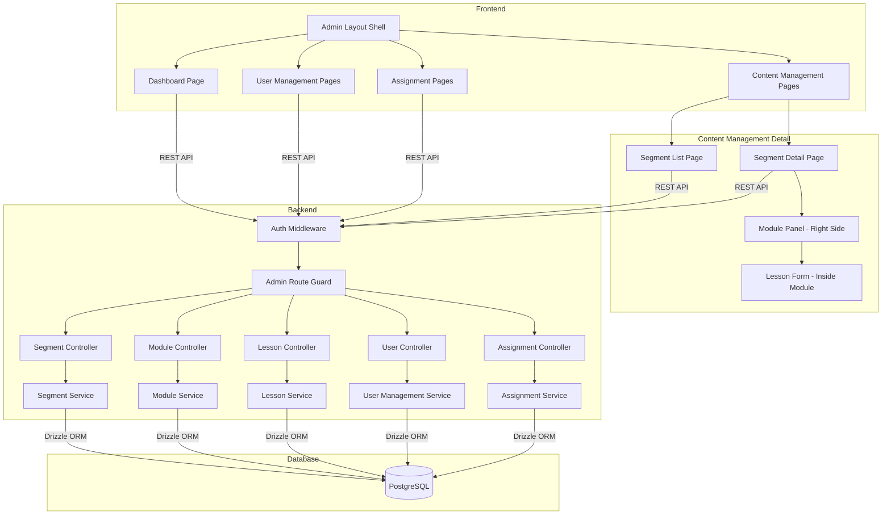

# Design Document

## Overview

This design defines the implementation approach for Milestone 2: Admin Content Management. M2 enables admins to fully create and manage the Segment → Module → Lesson content hierarchy, manage user accounts, and assign users to segments. Modules and Lessons are real admin-managed entities with full CRUD, not placeholders. The content created here feeds directly into M3 (learner lesson viewing) and M4 (quiz association).

### Purpose

The design covers admin dashboard, full content management (Segment with duration, Module inside Segment, Lesson inside Module with estimated time), user management, and segment assignment — matching the Figma content management flow.

### Relevant Tech Context

- Monorepo application.
- Frontend: Vite, React, TypeScript, shadcn/ui, Tailwind CSS.
- Backend: Node.js, Express, PostgreSQL, Drizzle ORM.
- Validation: Zod.
- Auth: email/password stored in DB with hashed passwords.
- Emails: Nodemailer.

### Screenshot/Figma Context To Use

Kiro must read `.kiro/context/screenshot-catalog.md` before generating or modifying UI for this milestone.

Relevant screenshot assets:
- `.kiro/context/screenshots/DASHBOARD_SCREEN.png`
- `.kiro/context/screenshots/CONTENT_MANAGEMENT.png`
- `.kiro/context/screenshots/USER_MANAGMENT_SCREENS.png`
- `.kiro/context/screenshots/COMPONENTS.png`
- `.kiro/context/screenshots/STYLE.png`
- `.kiro/context/screenshots/OVERLAY.png`

### Content Management Figma Flow (CRITICAL)

The Figma defines the following admin content creation flow. This is the authoritative UI pattern for M2:

**1. Segment List Page:**
- Table/list showing all segments with status badges, dates, counts
- Row action menu: Edit, Archive Segment
- "Create Segment" button at top

**2. Segment Creation Wizard (multi-step):**
The segment creation follows a phase-wise wizard with 4 steps:
- **Step 1 — Segment Info:** Title (required), Description (optional), Duration in days (required, positive integer). Creates the segment via API on submission.
- **Step 2 — Modules:** Add/manage modules within the newly created segment. Each module expands to show its lessons inline. Lessons are added ONLY inside modules (no separate lesson section). Uses Add Module button (right-side panel/drawer) and Add Lesson button (inside each module).
- **Step 3 — Quiz:** Placeholder for M4. Shows "Quiz creation and management will be available in a future update."
- **Step 4 — Overview:** Summary of the segment (title, description, duration, status, module count, total lessons). "Finish" button navigates to segment detail page.

Step indicator at the top shows progress. Steps are navigable after Step 1 completes.

**3. Segment Detail / Content Management Screen (for existing segments):**
- Segment info displayed in header area (title, status badge, description, duration)
- Summary cards: Modules count, Total Lessons count, Assigned Users count
- Primary "Add Module" button with left icon, matching Figma styling
- List of existing Modules with lesson counts, sort order, and actions (edit, add lessons, reorder, delete)
- Modules expand to show lessons inline (no separate lesson page)
- Assigned Users section with pagination

**4. Module Panel (right-side drawer):**
- When admin clicks "Add Module", a right-side drawer appears
- Module drawer includes:
  - Module name/title input (required)
  - Description input (optional)
  - Save/Cancel actions
- Module belongs to a Segment through segment_id
- Module has sort_order for learner sequencing
- Lessons are managed inside each module (no separate lesson section exists)

**5. Lesson Management (inside Module panel):**
- "Add Lesson" button at the top of the module panel, matching Figma styling
- Below the button: grey/empty lesson list area
- Empty state text: "Saved lessons will appear here"
- When admin clicks "Add Lesson", lesson fields appear:
  - Lesson title
  - Lesson type selector (text / video)
  - Content upload/input area depending on lesson type
  - Estimated time value (number input)
  - Estimated time unit selector (minutes / hours)
  - Content details for the selected lesson type
- Lessons always exist within a Module context — never standalone

**6. Lesson Type Handling:**
- Text: Shows rich text / content_body input area
- Video: Shows video_url input for external links
- Upload/content input: UI supports upload/content input now; storage/upload implementation must follow final backend decision
- Quiz fields are NOT in M2 — quiz remains M4

### Milestone UI/Figma Gaps and Clarifications

- Duration is part of the segment form per Figma. It is stored as `duration` (integer, days) on the segment model.
- Assignment-specific `access_duration_days` on the assignment model is separate and used by M3 for per-user access windows.
- Exact upload behavior for lessons not finalized — UI provides the input; backend storage follows final decision.
- Screenshots show quiz steps in the wizard — these are NOT implemented in M2. Quiz creation remains M4.

## Architecture

### System Context

M2 operates within the existing monorepo as a set of admin-only features. The architecture follows a layered approach:



### Content Hierarchy Data Flow

```
Admin creates Segment (title, description, duration)
  └── Admin enters Segment Detail view
       └── Admin clicks "Add Module" → right-side panel opens
            └── Admin enters Module title → saves
                 └── Module appears in Segment context
                      └── Admin clicks "Add Lesson" inside Module
                           └── Lesson form appears (title, type, content, estimated time)
                                └── Admin saves → Lesson appears in Module's lesson list

Data structure ready for:
  - M3: Learner can view Segment → Module → Lesson content
  - M4: Quiz can be associated to Modules/Lessons
```

### API Structure

All admin endpoints are prefixed with `/api/admin/` and protected by:
1. **Auth Middleware** — verifies JWT token, attaches user context
2. **Admin Guard** — verifies `role === "admin"`, returns 403 otherwise

Request flow: `Client → Auth Middleware → Admin Guard → Controller → Service → Database`

### Backend Design Notes

- Segment includes duration field (integer, days) — stored on the segment model
- Module sort_order is auto-assigned and maintained contiguously
- Lesson includes estimated_time_value (integer) and estimated_time_unit (enum: "minutes" | "hours")
- Lesson content_type supports "text" and "video" with conditional required fields
- Content hierarchy enforces: Segment → Module → Lesson through foreign keys
- No quiz fields in M2 — quiz belongs to M4

## Components and Interfaces

### API Endpoints

| Method | Endpoint | Description | Request Body |
|--------|----------|-------------|--------------|
| GET | `/api/admin/dashboard/stats` | Dashboard statistics | — |
| POST | `/api/admin/segments` | Create segment | `{ title, description?, duration }` |
| GET | `/api/admin/segments` | List all segments | — |
| GET | `/api/admin/segments/:id` | Get segment with module count | — |
| PUT | `/api/admin/segments/:id` | Update segment | `{ title?, description?, duration?, status? }` |
| DELETE | `/api/admin/segments/:id` | Delete segment (no children) | — |
| POST | `/api/admin/segments/:segmentId/modules` | Create module | `{ title }` |
| GET | `/api/admin/segments/:segmentId/modules` | List modules in segment | — |
| PUT | `/api/admin/modules/:id` | Update module | `{ title? }` |
| PUT | `/api/admin/segments/:segmentId/modules/reorder` | Reorder modules | `{ orderedIds: string[] }` |
| DELETE | `/api/admin/modules/:id` | Delete module (no children) | — |
| POST | `/api/admin/modules/:moduleId/lessons` | Create lesson | `{ title, content_type, content_body?, video_url?, estimated_time_value?, estimated_time_unit? }` |
| GET | `/api/admin/modules/:moduleId/lessons` | List lessons in module | — |
| GET | `/api/admin/lessons/:id` | Get lesson with full content | — |
| PUT | `/api/admin/lessons/:id` | Update lesson | `{ title?, content_type?, content_body?, video_url?, estimated_time_value?, estimated_time_unit? }` |
| PUT | `/api/admin/modules/:moduleId/lessons/reorder` | Reorder lessons | `{ orderedIds: string[] }` |
| DELETE | `/api/admin/lessons/:id` | Delete lesson | — |
| POST | `/api/admin/users` | Create user | `{ name, email, role }` |
| GET | `/api/admin/users` | List users (paginated, searchable) | — |
| PUT | `/api/admin/users/:id` | Update user | `{ name?, role? }` |
| PUT | `/api/admin/users/:id/deactivate` | Deactivate user | — |
| POST | `/api/admin/users/:id/reset-password` | Reset password | — |
| POST | `/api/admin/assignments` | Assign user to segment | `{ user_id, segment_id, access_duration_days? }` |
| DELETE | `/api/admin/assignments/:id` | Remove assignment | — |
| GET | `/api/admin/segments/:segmentId/assignments` | List users assigned to segment | — |
| GET | `/api/admin/users/:userId/assignments` | List segments assigned to user | — |

### Service Interfaces

```typescript
// Segment Service
interface SegmentService {
  create(data: { title: string; description?: string; duration: number }): Promise<Segment>;
  list(params?: { page?: number; limit?: number; search?: string; status?: string }): Promise<PaginatedResult<Segment>>;
  getById(id: string): Promise<Segment & { moduleCount: number }>;
  update(id: string, data: Partial<{ title: string; description: string; duration: number; status: SegmentStatus }>): Promise<Segment>;
  delete(id: string): Promise<void>;
}

// Module Service
interface ModuleService {
  create(data: { title: string; segmentId: string }): Promise<Module>;
  listBySegment(segmentId: string): Promise<(Module & { lessonCount: number })[]>;
  update(id: string, data: Partial<{ title: string }>): Promise<Module>;
  reorder(segmentId: string, orderedIds: string[]): Promise<void>;
  delete(id: string): Promise<void>;
}

// Lesson Service
interface LessonService {
  create(data: {
    title: string;
    moduleId: string;
    contentType: 'text' | 'video';
    contentBody?: string;
    videoUrl?: string;
    estimatedTimeValue?: number;
    estimatedTimeUnit?: 'minutes' | 'hours';
  }): Promise<Lesson>;
  listByModule(moduleId: string): Promise<Lesson[]>;
  getById(id: string): Promise<Lesson>;
  update(id: string, data: Partial<LessonUpdate>): Promise<Lesson>;
  reorder(moduleId: string, orderedIds: string[]): Promise<void>;
  delete(id: string): Promise<void>;
}

// User Management Service
interface UserManagementService {
  create(data: { name: string; email: string; role: UserRole }): Promise<UserProfile>;
  list(params: { page?: number; limit?: number; search?: string }): Promise<PaginatedResult<UserProfile>>;
  update(id: string, data: Partial<UserUpdate>): Promise<UserProfile>;
  deactivate(id: string): Promise<void>;
  resetPassword(id: string): Promise<{ temporaryPassword: string }>;
}

// Assignment Service
interface AssignmentService {
  assign(data: { userId: string; segmentId: string; accessDurationDays?: number }): Promise<Assignment>;
  remove(id: string): Promise<void>;
  listBySegment(segmentId: string): Promise<PaginatedResult<SegmentAssignment>>;
  listByUser(userId: string): Promise<PaginatedResult<UserAssignment>>;
}
```

### Frontend Components (Figma Flow)

**Layout:**
- `AdminLayout` — existing component with sidebar, nav, footer

**Dashboard:**
- `DashboardPage` — stats cards, quick actions, segment overview

**Content Management (Figma-driven hierarchy):**
- `SegmentListPage` — table/list with status badges, duration, module count, row actions
- `SegmentDetailPage` — main content area showing segment info + module management
  - Left/main area: Segment form fields (title, description, duration, status)
  - "Add Module" button with left icon (primary styling)
  - Module list within segment context
- `ModulePanel` — right-side panel that appears when "Add Module" is clicked
  - Module title input
  - Save/Cancel actions
  - After creation: shows module detail with lesson management
- `LessonForm` — appears inside Module panel when "Add Lesson" is clicked
  - Title input
  - Lesson type selector (text/video)
  - Content input area (conditional on type)
  - Estimated time value + unit selector (minutes/hours)
  - Save/Cancel actions
- `LessonList` — inside Module panel
  - Grey container area
  - Empty state: "Saved lessons will appear here"
  - Populated: lesson cards with title, type badge, estimated time, actions

**IMPORTANT: No disconnected "Modules Page" or "Lessons Page". All module/lesson management happens within Segment detail context.**

**User Management:**
- `UserListPage` — searchable table with filters and row actions
- `UserCreateForm` — form with role dropdown, segment assignment
- `UserProfilePage` — admin view of user details, assignments

**Assignment:**
- `AssignTrainingPage` — segment selector, user checklist, duration/date fields

**Shared (reuse from M1):**
- `Button` — primary/secondary/outline variants
- `Toast` — success/error/info notifications
- `ConfirmationDialog` — destructive action confirmation
- `SuccessModal` — centered green check, title, action button
- `ActionMenu` — row-level dropdown actions
- `StatusBadge` — draft/active/archived/deactivated badges
- `LoadingIndicator` — consistent loading state

## Data Models

### Segments Table (with Duration)

```typescript
export const segments = pgTable('segments', {
  id: uuid('id').primaryKey().defaultRandom(),
  title: varchar('title', { length: 255 }).notNull(),
  description: text('description'),
  duration: integer('duration'), // Duration in days, per Figma segment form
  status: segmentStatusEnum('status').notNull().default('draft'), // 'draft' | 'active' | 'archived'
  createdAt: timestamp('created_at').notNull().defaultNow(),
  updatedAt: timestamp('updated_at').notNull().defaultNow(),
});
```

### Modules Table

```typescript
export const modules = pgTable('modules', {
  id: uuid('id').primaryKey().defaultRandom(),
  segmentId: uuid('segment_id').notNull().references(() => segments.id, { onDelete: 'restrict' }),
  title: varchar('title', { length: 255 }).notNull(),
  sortOrder: integer('sort_order').notNull().default(0),
  createdAt: timestamp('created_at').notNull().defaultNow(),
  updatedAt: timestamp('updated_at').notNull().defaultNow(),
});
```

### Lessons Table (with Estimated Time)

```typescript
export const lessons = pgTable('lessons', {
  id: uuid('id').primaryKey().defaultRandom(),
  moduleId: uuid('module_id').notNull().references(() => modules.id, { onDelete: 'restrict' }),
  title: varchar('title', { length: 255 }).notNull(),
  contentType: lessonContentTypeEnum('content_type').notNull(), // 'text' | 'video'
  contentBody: text('content_body'), // required when content_type = 'text'
  videoUrl: varchar('video_url', { length: 2048 }), // required when content_type = 'video'
  estimatedTimeValue: integer('estimated_time_value'), // e.g., 15, 30, 1, 2
  estimatedTimeUnit: varchar('estimated_time_unit', { length: 10 }), // 'minutes' | 'hours'
  sortOrder: integer('sort_order').notNull().default(0),
  createdAt: timestamp('created_at').notNull().defaultNow(),
  updatedAt: timestamp('updated_at').notNull().defaultNow(),
});
```

### Segment Assignments Table

```typescript
export const segmentAssignments = pgTable('segment_assignments', {
  id: uuid('id').primaryKey().defaultRandom(),
  userId: uuid('user_id').notNull().references(() => users.id, { onDelete: 'restrict' }),
  segmentId: uuid('segment_id').notNull().references(() => segments.id, { onDelete: 'restrict' }),
  accessDurationDays: integer('access_duration_days'), // assignment-specific, used by M3
  assignedAt: timestamp('assigned_at').defaultNow().notNull(),
}, (table) => ({
  uniqueAssignment: unique().on(table.userId, table.segmentId),
}));
```

### Data Model Notes

- `segments.duration` is the Figma-specified segment duration field. Separate from `segment_assignments.access_duration_days`.
- `lessons.estimated_time_value` + `lessons.estimated_time_unit` store the time estimate per the Figma lesson form.
- `modules` no longer has a `description` field (simplified per Figma — module only needs title). If description was already in schema, it can remain but is not required in the UI.
- No quiz-related tables in M2.

## Correctness Properties

### Property 1: Segment Status Transition Validity

*For any* Segment and any attempted status transition, the transition SHALL succeed if and only if it follows the valid state machine: draft→active, draft→archived, active→archived. All transitions from "archived" SHALL be rejected.

**Validates: Requirements 2.8, 2.9, 2.10, 9.1–9.7**

### Property 2: Module Sort Order Contiguity Invariant

*For any* Segment, after any sequence of module creation, deletion, or reorder operations, the sort_order values of all Modules within that Segment SHALL form a contiguous sequence starting from 1 with no duplicates and no gaps.

**Validates: Requirements 3.1, 3.6, 3.7, 3.9, 7.6**

### Property 3: Lesson Sort Order Contiguity Invariant

*For any* Module, after any sequence of lesson creation, deletion, or reorder operations, the sort_order values of all Lessons within that Module SHALL form a contiguous sequence starting from 1 with no duplicates and no gaps.

**Validates: Requirements 4.1, 4.2, 4.10, 4.11, 4.12, 7.7**

### Property 4: Assignment Round-Trip (Assign then List Includes)

*For any* valid user and segment, assigning the user to the segment and then listing users assigned to that segment SHALL include the assigned user in the result set.

**Validates: Requirements 6.1, 6.6, 6.9**

### Property 5: Assignment Removal Round-Trip (Remove then List Excludes)

*For any* existing assignment, removing the assignment and then listing users assigned to that segment SHALL exclude the removed user from the result set.

**Validates: Requirements 6.5, 6.10**

### Property 6: Segment Duration Persistence

*For any* valid segment creation or update with a duration value, fetching the segment SHALL return the persisted duration value exactly as stored.

**Validates: Requirements 2.1, 2.5, 2.7**

### Property 7: Lesson Estimated Time Persistence

*For any* valid lesson creation or update with estimated_time_value and estimated_time_unit, fetching the lesson SHALL return both fields exactly as stored.

**Validates: Requirements 4.1, 4.2, 4.8, 4.15**

### Property 8: Password Hash Never Exposed

*For any* API response from any user-related endpoint, the response body SHALL never contain a password hash field.

**Validates: Requirements 5.1, 5.11**

## Error Handling

### API Error Response Shape

```typescript
interface ApiErrorResponse {
  error: {
    code: string;        // e.g., "VALIDATION_ERROR", "NOT_FOUND", "FORBIDDEN", "CONFLICT"
    message: string;     // Human-readable message
    fields?: Record<string, string>; // Field-specific validation errors
  };
}
```

### Error Categories

| HTTP Status | Error Code | Scenario |
|-------------|-----------|----------|
| 400 | `VALIDATION_ERROR` | Missing/invalid fields (title, duration, estimated_time) |
| 400 | `INVALID_STATUS_TRANSITION` | Archived segment cannot change status |
| 400 | `HAS_CHILDREN` | Cannot delete segment with modules or module with lessons |
| 401 | `UNAUTHORIZED` | Missing or invalid JWT token |
| 403 | `FORBIDDEN` | Non-admin accessing admin endpoints |
| 404 | `NOT_FOUND` | Entity does not exist |
| 409 | `CONFLICT` | Duplicate email or duplicate assignment |
| 500 | `INTERNAL_ERROR` | Unexpected server error |

### Frontend Error Display

- API errors displayed as toast notifications via `useToast()` hook
- Inline form validation errors shown below fields (title required, duration must be positive)
- Destructive actions always show confirmation dialog before execution
- Loading states use consistent spinner patterns

## Testing Strategy

### Unit Tests

- **Segment Service**: Test CRUD with duration field, status transitions, validation (title required, duration positive integer)
- **Module Service**: Test creation assigns sort_order, deletion reorders, reorder maintains contiguity, 404 for non-existent segment
- **Lesson Service**: Test content_type validation (text requires content_body, video requires video_url), estimated time fields persistence, sort_order contiguity
- **User Service**: Test creation with duplicate email (409), password hash never exposed, search filters case-insensitively
- **Assignment Service**: Test assign/remove round-trips, 409 for duplicates, 404 for non-existent entities
- **Validation**: Test Zod schemas reject invalid payloads (missing title, invalid duration, invalid URL)

### Property-Based Tests (fast-check)

- Property 1: Segment status transition validity
- Property 2: Module sort order contiguity invariant
- Property 3: Lesson sort order contiguity invariant
- Property 4: Assignment round-trip (assign then list includes)
- Property 5: Assignment removal round-trip (remove then list excludes)
- Property 6: Segment duration persistence round-trip
- Property 7: Lesson estimated time persistence round-trip
- Property 8: Password hash never exposed

### Integration Tests

- Full content hierarchy: create segment (with duration) → add modules → add lessons (with estimated time) → verify listing
- Referential integrity: delete segment with modules fails, delete module with lessons fails
- Auth flow: admin-only endpoints reject non-admin and unauthenticated requests
- Assignment flow: assign → list → remove → verify
- Dashboard stats: accurate after entity creation

## Scope Guardrails

- M2 fully implements admin content creation for Segment → Module → Lesson.
- Modules and Lessons are real entities, NOT placeholders.
- Do NOT implement quiz creation, quiz submission, quiz scoring, or quiz progress in M2. Quiz belongs to M4.
- Do NOT implement learner-side lesson consumption/viewing/completion in M2. Learner viewing belongs to M3.
- M2 MUST create the full admin-managed content structure that M3 and M4 depend on.
- Bulk user imports excluded.
- Role-based admin permissions excluded.
- SSO, MFA, analytics, certificates excluded.
