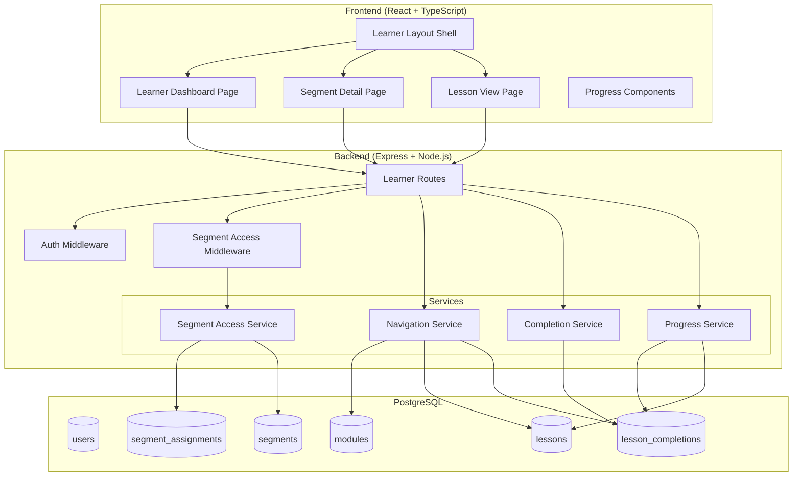
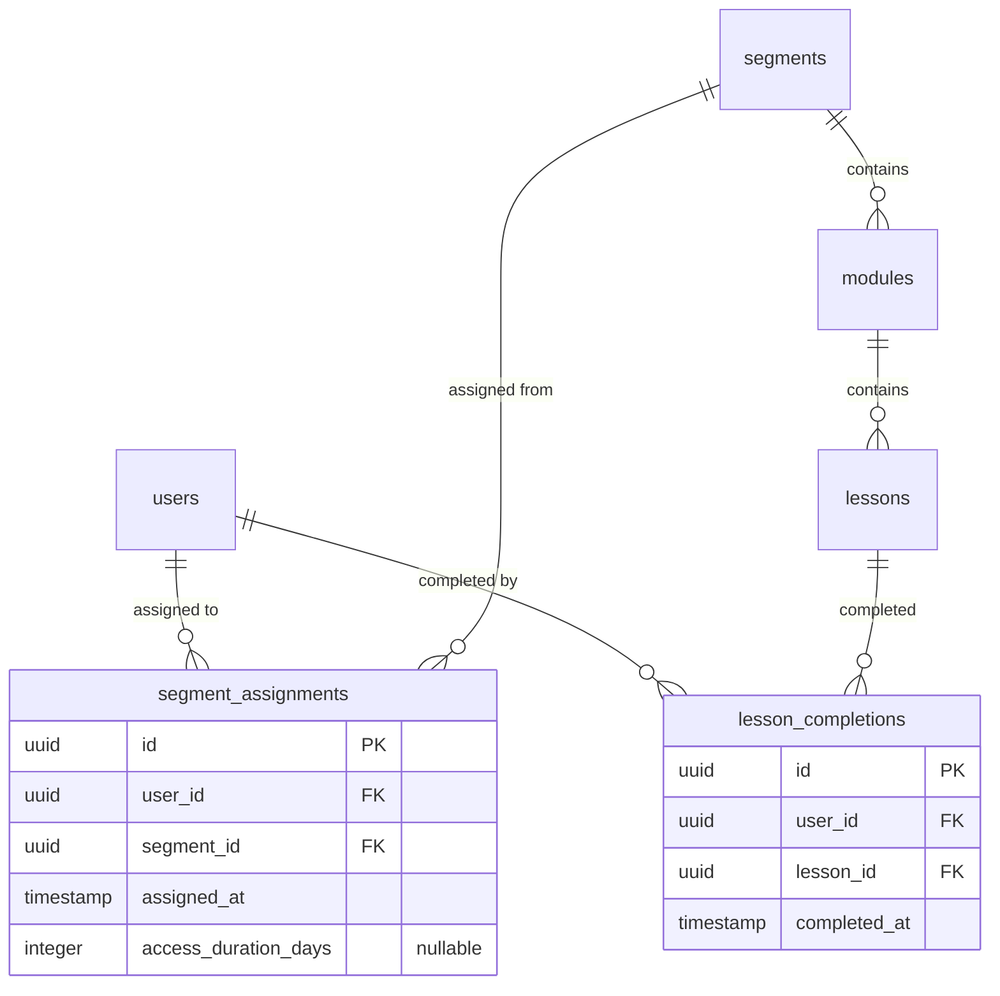

# Design Document

## Overview

### Purpose

This design defines the implementation approach for M3: User Learning Experience — the learner-facing portion of the Rhose platform covering dashboard, segment access, lesson viewing, completion tracking, sequential progression, and progress display.

### Relevant Tech Context

- Monorepo application.
- Frontend: Vite, React, TypeScript, shadcn/ui, Tailwind CSS.
- Backend: Node.js, Express, PostgreSQL, Drizzle ORM.
- Validation: Zod.
- Auth: email/password stored in DB with hashed passwords (JWT-based).
- Emails: Nodemailer.

### Screenshot/Figma Context

Kiro must read `.kiro/context/screenshot-catalog.md` before generating or modifying UI for this milestone.

Relevant screenshot assets:
- `.kiro/context/screenshots/LESSON_VIDEO_and_TEXTSLIDE.png` — Lesson views, active training dashboard
- `.kiro/context/screenshots/COMPONENTS.png` — Segment content accordion, module/lesson navigation
- `.kiro/context/screenshots/MOBILE_VIEW.png` — Mobile responsive layouts
- `.kiro/context/screenshots/STYLE.png` — Design tokens, typography, color palette
- `.kiro/context/screenshots/OVERLAY.png` — Button variants, input states, status badges, modals

### Screen and Flow Interpretation

M3 covers learner dashboard, active training, segment access, lesson view, and lesson completion.

**Learner Active Training Dashboard:**
- Sidebar has Dashboard and Profile.
- Page title: Your Active Training.
- Segment title and description appear above progress.
- Progress card shows percentage and completed step count.
- Resume Lesson is a navy primary action.
- Segment Details cards show Duration, Deadline, and Time Left.
- Segment Content uses accordion module rows.

**Segment/Module Navigation:**
- Module accordion states: completed with green check, current/in-progress with clock/progress icon, locked with muted disabled row and lock icon.
- Expanded module shows lesson list with vertical timeline and metadata such as Video/Article and estimated duration/read time.
- Quiz appears after modules and may be locked until appropriate point, but quiz must not block progression unless SOW changes.

**Lesson View:**
- Left contextual panel includes Back to Dashboard, segment summary, instructor block, progress indicator, and module accordion.
- Main content includes module/lesson breadcrumb, status badge, video player or slide viewer, thumbnail carousel for slides, and Mark as Complete button.
- Video area should be responsive 16:9.
- Slide/text lesson viewer should support large preview and thumbnails where content type requires it.

**Mobile:**
- Use compact single-column cards.
- Lesson header includes back arrow, module/lesson context, status badge, and menu icon.
- Module navigation can open as drawer/overlay.

### UI Implementation Instructions

- Keep the UI consistent with `.kiro/steering/ui-style-guide.md`, `.kiro/steering/design-system.md`, `.kiro/context/screenshot-catalog.md`, `STYLE.png`, and `OVERLAY.png`.
- Use shadcn/ui primitives where they match the screenshots, but centralize variants in shared components instead of scattering one-off Tailwind classes.
- Preserve the screenshot visual system: Inter typography, teal active states, navy primary actions, white cards, light borders, subtle shadows, rounded corners, status badges, and responsive 4-column/mobile and 12-column/desktop grids.
- Do not invent missing flows. If the SOW requires something not shown in screenshots, implement safe structure and mark the missing UI state as a gap.
- Treat screenshots as UI/UX references, not automatic scope additions.

### Milestone UI/Figma Gaps and Clarifications

- Instructor data appears in screenshots but is not clearly defined in the SOW. Implement only if a simple instructor field exists or mark as pending.
- Slide deck viewer appears in screenshots, while SOW mentions text and external videos. Treat slide viewer as a UI reference for text/visual content only unless client confirms slide/PPT support.
- Lesson durations/read times are shown in UI. Add fields only if agreed; otherwise calculate/display placeholder only when backend data exists.
- Quiz lock display appears in component screenshot but quizzes are non-blocking. Do not block lesson progression because of quiz completion.

## Architecture

### System Overview

The M3 learner experience follows a layered architecture with clear separation between access control, business logic, and presentation.



### Access Control Flow

Every learner content request passes through a two-stage gate:

1. **Authentication** — JWT token validation via Auth Middleware (401 if missing/invalid)
2. **Segment Access** — Segment Access Service verifies:
   - User has an assignment record for the requested segment
   - Assignment is within its access duration (or has no expiry)
   - Segment status is "active" (not draft/archived)

Sequential lesson access adds a third check:
3. **Progression** — Navigation Service verifies all prerequisite lessons (sort_order 1..N-1) are completed before granting access to lesson N.

### Key Design Decisions

| Decision | Rationale |
|----------|-----------|
| Access checks as middleware | Keeps controllers thin; reusable across all learner endpoints |
| Idempotent completion | Prevents duplicate records; safe for retry/network issues |
| UTC date comparison for expiry | Avoids timezone ambiguity across learners |
| Progress calculated on-read | Avoids stale cached values; lesson count is small enough for real-time calculation |
| Sequential enforcement server-side | Cannot trust client; server is source of truth for progression |
| Null duration = unlimited | Simple default; no special "forever" sentinel value needed |

## Components and Interfaces

### Backend API Endpoints

#### Learner Dashboard

| Method | Path | Description |
|--------|------|-------------|
| GET | `/api/learner/segments` | List assigned segments with progress and access status |

**Response shape:**
```typescript
{
  segments: Array<{
    id: string;
    title: string;
    description: string;
    progress_percentage: number;
    completed_lessons: number;
    total_lessons: number;
    access_status: "active" | "expired";
    assigned_at: string;
  }>;
}
```

#### Segment Detail & Navigation

| Method | Path | Description |
|--------|------|-------------|
| GET | `/api/learner/segments/:segmentId` | Segment detail with modules and progress |
| GET | `/api/learner/segments/:segmentId/modules/:moduleId/lessons` | Lessons in a module with completion status |
| GET | `/api/learner/segments/:segmentId/modules/:moduleId/lessons/:lessonId` | Single lesson content |
| GET | `/api/learner/segments/:segmentId/current-lesson` | Current lesson (first incomplete) |

#### Lesson Completion

| Method | Path | Description |
|--------|------|-------------|
| POST | `/api/learner/lessons/:lessonId/complete` | Mark lesson as complete (idempotent) |

**Response shape:**
```typescript
{
  completed: true;
  completed_at: string;
  next_lesson_id: string | null;
  module_complete: boolean;
  segment_complete: boolean;
}
```

#### Progress

| Method | Path | Description |
|--------|------|-------------|
| GET | `/api/learner/segments/:segmentId/progress` | Segment-level progress |
| GET | `/api/learner/modules/:moduleId/progress` | Module-level progress |

### Service Interfaces

```typescript
// Segment Access Service
interface SegmentAccessService {
  verifyAccess(userId: string, segmentId: string): Promise<AccessResult>;
}

type AccessResult =
  | { granted: true }
  | { granted: false; code: "ACCESS_DENIED" | "ACCESS_EXPIRED" | "SEGMENT_UNAVAILABLE" };

// Navigation Service
interface NavigationService {
  getSegmentDetail(userId: string, segmentId: string): Promise<SegmentDetail>;
  getModuleLessons(userId: string, moduleId: string): Promise<LessonListItem[]>;
  getLessonContent(userId: string, lessonId: string): Promise<LessonContent>;
  getCurrentLesson(userId: string, segmentId: string): Promise<CurrentLesson>;
  canAccessLesson(userId: string, lessonId: string): Promise<boolean>;
}

// Completion Service
interface CompletionService {
  completeLesson(userId: string, lessonId: string): Promise<CompletionResult>;
}

// Progress Service
interface ProgressService {
  getSegmentProgress(userId: string, segmentId: string): Promise<SegmentProgress>;
  getModuleProgress(userId: string, moduleId: string): Promise<ModuleProgress>;
}
```

### Frontend Components

| Component | Location | Responsibility |
|-----------|----------|----------------|
| `LearnerLayout` | `features/learning/layout/` | Sidebar + main content shell for learner pages |
| `LearnerDashboard` | `features/learning/pages/` | Assigned segments grid with progress cards |
| `SegmentDetailPage` | `features/learning/pages/` | Module accordion with progress indicators |
| `LessonPage` | `features/learning/pages/` | Lesson content renderer (text or video) |
| `SegmentCard` | `features/learning/components/` | Individual segment card with status/progress |
| `ModuleAccordion` | `features/learning/components/` | Expandable module with lesson list |
| `LessonTimeline` | `features/learning/components/` | Vertical timeline of lessons with status dots |
| `VideoEmbed` | `features/learning/components/` | 16:9 responsive iframe for YouTube/Vimeo |
| `TextContent` | `features/learning/components/` | Formatted text lesson renderer |
| `MarkCompleteButton` | `features/learning/components/` | Completion action with confirmation prompt |
| `LessonNavigation` | `features/learning/components/` | Previous/Next buttons with lock state |
| `ProgressBar` | `components/shared/` | Reusable progress bar (percentage + label) |
| `StatusBadge` | `components/shared/` | Status indicator (active, expired, completed, locked) |

### Frontend Design Rules

- Use shared service/API client hooks for data access.
- Use reusable layout shells for admin and learner areas.
- Use shared components for Button, FormField, Select/Dropdown, StatusBadge, Card, ActionMenu, SuccessModal, Sidebar, ProgressBar, and SegmentAccordion.
- Keep loading, empty, disabled, and error states visually consistent with the screenshot catalog.
- Mobile screens must be intentionally designed as stacked cards/drawers, not compressed desktop tables.

### API Design Rules

- Use Express route modules by feature.
- Validate request bodies and params with Zod.
- Enforce authentication on protected routes.
- Enforce admin access on admin routes.
- Enforce learner assignment and segment access checks on learner routes.
- Use consistent response shapes and error codes.
- Keep controllers thin and business logic in services.

## Data Models

### Existing Tables (referenced, not created in M3)

- `users` — id, email, name, role, password_hash, status
- `segments` — id, title, description, status (draft/active/archived), sort_order
- `modules` — id, segment_id, title, sort_order
- `lessons` — id, module_id, title, content_type (text/video), content_body, video_url, sort_order

### Extended Table: segment_assignments

```sql
-- Adding access_duration_days to existing assignment table
ALTER TABLE segment_assignments
ADD COLUMN access_duration_days INTEGER NULL;
```

```typescript
// Drizzle schema
export const segmentAssignments = pgTable("segment_assignments", {
  id: uuid("id").primaryKey().defaultRandom(),
  userId: uuid("user_id").notNull().references(() => users.id),
  segmentId: uuid("segment_id").notNull().references(() => segments.id),
  assignedAt: timestamp("assigned_at").notNull().defaultNow(),
  accessDurationDays: integer("access_duration_days"), // nullable = unlimited
});
```

**Access expiry logic:**
- If `access_duration_days` is `null` → no expiry (unlimited access)
- If `access_duration_days` is a positive integer → expiry = `assigned_at + access_duration_days` calendar days (UTC)
- Comparison: `current_utc_date > assigned_at_date + access_duration_days` → expired

### New Table: lesson_completions

```typescript
export const lessonCompletions = pgTable("lesson_completions", {
  id: uuid("id").primaryKey().defaultRandom(),
  userId: uuid("user_id").notNull().references(() => users.id),
  lessonId: uuid("lesson_id").notNull().references(() => lessons.id),
  completedAt: timestamp("completed_at").notNull().defaultNow(),
}, (table) => ({
  uniqueUserLesson: unique().on(table.userId, table.lessonId),
}));
```

**Constraints:**
- `UNIQUE(user_id, lesson_id)` — enforces idempotence at the database level
- `FOREIGN KEY(user_id)` → `users(id)`
- `FOREIGN KEY(lesson_id)` → `lessons(id)`

### Data Model Notes

- Only add tables needed for this milestone. Do not overbuild future milestone models unless required as a dependency.
- Kiro should update or create Drizzle schema definitions only where required by this milestone.

### Entity Relationship (M3 scope)



## Correctness Properties

*A property is a characteristic or behavior that should hold true across all valid executions of a system — essentially, a formal statement about what the system should do. Properties serve as the bridge between human-readable specifications and machine-verifiable correctness guarantees.*

### Property 1: Access Expiry Calculation

*For any* segment assignment with a non-null `access_duration_days` value and any reference date, the Segment Access Service SHALL classify the assignment as "active" if the reference date is within `assigned_at + access_duration_days` calendar days (UTC), and "expired" otherwise.

**Validates: Requirements 1.3, 1.4, 2.5, 10.4**

### Property 2: Access Control Invariant

*For any* authenticated learner and any segment content request, the Segment Access Service SHALL grant access if and only if: (a) an assignment record exists linking the user to the segment, AND (b) the assignment is within its access duration (or has null duration), AND (c) the segment status is "active". If any condition fails, the appropriate error code (ACCESS_DENIED, ACCESS_EXPIRED, or SEGMENT_UNAVAILABLE) SHALL be returned.

**Validates: Requirements 2.1, 2.2, 2.3, 2.4, 2.7**

### Property 3: Progress Percentage Calculation

*For any* segment with `total_lessons > 0` and a `completed_lessons` count where `0 <= completed_lessons <= total_lessons`, the Progress Service SHALL return `round((completed_lessons / total_lessons) * 100)` as the progress percentage. When `total_lessons = 0`, the result SHALL be 0.

**Validates: Requirements 1.5, 8.1, 8.3, 8.4**

### Property 4: Progress Invariant

*For any* progress calculation result, the completed lesson count SHALL be less than or equal to the total lesson count.

**Validates: Requirements 8.5**

### Property 5: Progress Metamorphic Property

*For any* segment progress state, completing exactly one additional lesson then querying progress SHALL show the completed count incremented by exactly one compared to the prior state.

**Validates: Requirements 8.6**

### Property 6: Lesson Completion Idempotence

*For any* user and lesson, submitting a completion confirmation N times (where N >= 1) SHALL produce exactly one `lesson_completion` record with the same `completed_at` timestamp as the first submission.

**Validates: Requirements 6.2, 6.7, 10.6, 10.9**

### Property 7: Lesson Completion Round-Trip

*For any* user and lesson, after successfully completing the lesson, querying that lesson's completion status for the same user SHALL return "completed".

**Validates: Requirements 6.6**

### Property 8: Sequential Access Invariant

*For any* module with lessons ordered by `sort_order`, a learner SHALL be granted access to the lesson at position N if and only if all lessons at positions 1 through N-1 have been completed by that learner. The first lesson (position 1) is always accessible.

**Validates: Requirements 7.1, 7.2, 7.3, 7.6**

### Property 9: Current Lesson Determination

*For any* segment and learner completion state, the "current lesson" SHALL be the first incomplete lesson (by `sort_order`) within the first incomplete module (by `sort_order`). If all lessons are complete, the result SHALL indicate segment completion.

**Validates: Requirements 7.7, 7.5**

### Property 10: Ordering Invariant

*For any* list of assigned segments returned by the dashboard, segments SHALL be ordered by `assigned_at` descending. *For any* list of modules within a segment, modules SHALL be ordered by `sort_order` ascending.

**Validates: Requirements 1.8, 3.2**

## Error Handling

### Learner-Specific Error Codes

| Error Code | HTTP Status | Condition | Response Body |
|------------|-------------|-----------|---------------|
| `ACCESS_DENIED` | 403 | User has no assignment to the requested segment | `{ error: { code: "ACCESS_DENIED", message: "You do not have access to this segment." } }` |
| `ACCESS_EXPIRED` | 403 | Assignment access duration has elapsed | `{ error: { code: "ACCESS_EXPIRED", message: "Your access to this segment has expired." } }` |
| `SEGMENT_UNAVAILABLE` | 403 | Segment status is draft or archived | `{ error: { code: "SEGMENT_UNAVAILABLE", message: "This segment is not currently available." } }` |
| `LESSON_LOCKED` | 403 | Prerequisite lesson not completed | `{ error: { code: "LESSON_LOCKED", message: "Complete the previous lesson first.", prerequisite_lesson_id: "<id>" } }` |
| `UNAUTHORIZED` | 401 | Missing or invalid JWT token | `{ error: { code: "UNAUTHORIZED", message: "Authentication required." } }` |
| `FORBIDDEN` | 403 | Non-learner role accessing learner endpoints | `{ error: { code: "FORBIDDEN", message: "Access denied." } }` |
| `NOT_FOUND` | 404 | Lesson/segment/module does not exist | `{ error: { code: "NOT_FOUND", message: "Resource not found." } }` |
| `VALIDATION_ERROR` | 400 | Invalid request params (Zod validation failure) | `{ error: { code: "VALIDATION_ERROR", message: "<details>" } }` |

### Error Handling Strategy

- **Auth errors** are caught by Auth Middleware before reaching route handlers.
- **Access errors** are caught by Segment Access Middleware, returning the specific error code.
- **Sequential access errors** are caught by Navigation Service within the lesson route handler.
- **Validation errors** are caught by Zod schema validation middleware.
- **Unexpected errors** return a generic 500 response without leaking internal details.

### Frontend Error Display

- API errors are displayed as user-visible toast/banner messages using the error `message` field.
- Technical details (stack traces, internal codes) are never shown to learners.
- Loading states use skeleton/spinner components consistent with the screenshot catalog.
- Network failures show a retry-able error state.

## Testing Strategy

### Unit Tests (Example-Based)

Unit tests cover specific scenarios, edge cases, and integration points:

- **Access Service**: Test with valid assignment (active), expired assignment, no assignment, null duration, draft/archived segment
- **Completion Service**: Test first completion creates record, duplicate returns 200 without new record, non-existent lesson returns 404
- **Navigation Service**: Test first lesson always accessible, locked lesson returns prerequisite ID, cross-module progression
- **Progress Service**: Test zero lessons returns 0%, partial completion, full completion
- **Frontend Components**: Test responsive layout breakpoints, loading states, empty states, Mark as Complete confirmation flow, Previous/Next button disabled states

### Property-Based Tests

Property-based tests validate universal correctness properties using `fast-check` (TypeScript PBT library). Each test runs a minimum of 100 iterations.

| Property | Test Description | Tag |
|----------|-----------------|-----|
| Property 1 | Generate random `assigned_at` + `access_duration_days` + reference dates, verify classification | Feature: m3-user-learning-experience, Property 1: Access expiry calculation |
| Property 2 | Generate random user/segment/assignment/status combinations, verify access decision | Feature: m3-user-learning-experience, Property 2: Access control invariant |
| Property 3 | Generate random `completed`/`total` pairs, verify formula | Feature: m3-user-learning-experience, Property 3: Progress percentage calculation |
| Property 4 | Generate random progress states, verify `completed <= total` | Feature: m3-user-learning-experience, Property 4: Progress invariant |
| Property 5 | Generate random state, complete one lesson, verify +1 increment | Feature: m3-user-learning-experience, Property 5: Progress metamorphic |
| Property 6 | Generate random user-lesson pairs, complete N times, verify single record | Feature: m3-user-learning-experience, Property 6: Lesson completion idempotence |
| Property 7 | Generate random user-lesson, complete then query, verify "completed" | Feature: m3-user-learning-experience, Property 7: Lesson completion round-trip |
| Property 8 | Generate random modules with N lessons and completion states, verify access rules | Feature: m3-user-learning-experience, Property 8: Sequential access invariant |
| Property 9 | Generate random completion patterns, verify current lesson identification | Feature: m3-user-learning-experience, Property 9: Current lesson determination |
| Property 10 | Generate random segment/module lists, verify ordering | Feature: m3-user-learning-experience, Property 10: Ordering invariant |

### Integration Tests

- **Database constraints**: Verify unique constraint on `(user_id, lesson_id)` in `lesson_completions`
- **Foreign key enforcement**: Verify referential integrity for user and lesson references
- **End-to-end flows**: Authenticated learner completes a full segment (dashboard → segment → module → lessons → completion)
- **Access expiry**: Verify time-based access denial with controlled timestamps

### Test Configuration

- PBT library: `fast-check`
- Minimum iterations per property: 100
- Test runner: Vitest (with `--run` flag for single execution)
- Each property test tagged with: `Feature: m3-user-learning-experience, Property {N}: {title}`
