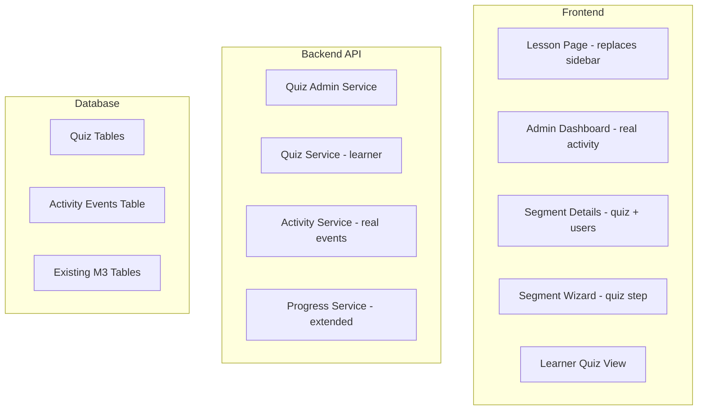

# Design Document

## Overview

### Purpose

This design defines the implementation approach for M4: Quizzes & Progress Tracking. It covers:
1. Quiz data model (per-segment quizzes)
2. Admin quiz CRUD integrated into the segment creation wizard and details page
3. Learner quiz-taking with non-blocking flow
4. Enhanced progress tracking with quiz attempt data
5. **Fix: Learner lesson page layout** (left panel replaces sidebar)
6. **Fix: Admin dashboard Real Activity** (not hardcoded)
7. **Fix: Admin Segment Details page** (quiz section, assigned users, segment info card)
8. **Fix: Admin Dashboard Segment Overview** (rich metadata per screenshot)
9. **Fix: Content Management list** (richer row metadata)

### Relevant Tech Context

- Monorepo: frontend (Vite, React, TypeScript, shadcn/ui, Tailwind) + backend (Node.js, Express, PostgreSQL, Drizzle ORM)
- Validation: Zod
- Auth: JWT with role-based access
- Existing patterns: AdminLayout/LearnerLayout with sidebar, React Query hooks, shared UI components

### Key UI Observations from Screenshots

**Learner Lesson Page (VIDEO LESSONS screenshot):**
- The left panel **replaces** the LearnerLayout sidebar entirely — no Dashboard/My Learning/Profile links visible
- Panel contains: "< Back to Dashboard", segment title (teal), description (truncated with "See more..."), Instructor (avatar + name), Progress bar with "45%" and "10/18 Steps", Module accordion (MODULES 1-5 with status icons)
- Main area: breadcrumb "Modules 4 • Cycle Monitoring", "In Progress" badge (top-right), video player, "Mark as Complete" button (coral/salmon colored, below content)

**Admin Dashboard (DASHBOARD SCREEN screenshot):**
- Quick Actions: "Assign Segment" (navy filled with icon), "Create User" (outline), "Add New Segment" (outline with + icon)
- Stats: Total Users (248), Active Segment (3, with "2 Ending Soon" sub-text), Total Modules (45), Total Lessons (186)
- Segment Overview: rows with segment name, calendar icon + date, user icon + count, status badge (Ending Soon/Expired/On Track), progress bar. Filter icon + "All" dropdown. "View All Segment" link at bottom.
- Recent Activity: user avatar, name abbreviated ("Amaka O."), description ("Completed Module 2"), detail line ("Instrument Sterilization"), timestamp ("5m ago"). Includes quiz pass/fail with "Score: 8/10". Filter icon + "All" dropdown.

**Segment Details (screenshot):**
- Status badge "Active" at top
- Sections: Segment Info (name, duration, description + edit pencil), Modules (list with title + "N Lessons" + edit pencil), Quiz ("Q 1: ...", "Q 2: ..." + edit pencil), Assigned Users ("Add/Remove User" button, search bar, user list with name, job title, progress bar), Segment Info card (Created, Users Assigned, Completion Rate)
- "Unpublish" button bottom-right (red/coral)

**Create Segment Wizard (screenshot):**
- 4-step stepper: Segment Info → Add Modules → Add Lesson → Preview
- Preview page: Segment Info section, Modules section, Quiz section with numbered questions
- "Add Questions" drawer: question text field, options with checkboxes, Save/Cancel
- Bottom actions: "Back" (outline), "Save as Draft" (outline), "Publish" (navy filled)

**Content Management List (screenshot):**
- Header: "Content Management", Search bar (top-right), "Create New Segment" button (navy filled with icon)
- Rows: segment name (bold), metadata line (calendar icon "4 Weeks", module icon "5 Modules", user icon "45 Users Assigned"), Status badge, Created date, three-dot action menu
- Action menu: Edit, Reset Password, Archive Segment (red text)

## Architecture

### System Context



### Key Architectural Decisions

1. **Quiz is per-segment**: Based on screenshots, quiz is shown as a section within segment (not per-lesson/module). The quiz_schema has segment_id FK.

2. **Lesson page replaces sidebar**: The LessonPage component will signal to LearnerLayout to hide the standard navigation and render its own left panel instead. Implementation: use a layout context or render LessonPage outside the LearnerLayout route (with its own shell).

3. **Real activity tracking**: A lightweight `activity_events` table stores user actions. The admin dashboard queries recent events and displays them with user info.

4. **Non-blocking by design**: Navigation/Completion services are never modified to check quiz state.

5. **Score calculation in service layer**: Happens at submission time, not via DB triggers.

### Learner Lesson Page Layout Architecture

**Current (broken):** LearnerLayout renders sidebar (Dashboard/My Learning/Profile/Logout) → LessonPage renders its own `<aside>` inside the content area → Results in TWO sidebars visible.

**Fixed approach:** The LessonPage route should render OUTSIDE the standard LearnerLayout OR LearnerLayout should accept a prop/context to hide its sidebar when on lesson pages. The cleanest approach:

Option A: Render LessonPage with a dedicated `LessonLayout` that has NO sidebar navigation, only the lesson panel on the left.

Option B: Use React context/outlet to tell LearnerLayout to hide sidebar when route matches `/learner/segments/:segmentId/modules/:moduleId/lessons/:lessonId`.

**Recommended: Option A** — Create a `LessonLayout` wrapper that only renders the mobile hamburger (for mobile drawer) but no desktop sidebar. The LessonPage itself renders the full left panel.

### Backend Module Structure

```
backend/src/modules/quizzes/
  quiz.controller.ts       — Route handlers
  quiz.service.ts          — Learner quiz logic
  quiz-admin.service.ts    — Admin CRUD logic
  quiz.schema.ts           — Zod validation schemas
  quiz.routes.ts           — Express route definitions

backend/src/modules/activity/
  activity.service.ts      — Track and query real events
  activity.controller.ts   — GET /api/admin/activity
  activity.routes.ts       — Route definitions
```

### Frontend Changes

```
frontend/src/
  components/layout/
    LessonLayout.tsx        — NEW: Layout for lesson pages (no sidebar nav)
  pages/learner/
    LessonPage.tsx          — UPDATED: renders full left panel
  pages/
    AdminDashboard.tsx      — UPDATED: real activity, rich segment overview
  pages/admin/
    SegmentDetailsPage.tsx  — UPDATED: quiz section, assigned users, info card
    SegmentCreateWizard.tsx — UPDATED: quiz step in wizard, preview quiz section
    QuizDrawer.tsx          — NEW: side-panel for adding/editing questions
```

## Components and Interfaces

### API Endpoints

#### Admin Quiz Endpoints

| Method | Path | Description |
|--------|------|-------------|
| POST | `/api/admin/segments/:segmentId/quiz` | Create/update quiz for segment |
| GET | `/api/admin/segments/:segmentId/quiz` | Get quiz with questions for segment |
| PUT | `/api/admin/segments/:segmentId/quiz` | Update quiz questions/options |
| DELETE | `/api/admin/segments/:segmentId/quiz` | Delete segment's quiz |

#### Learner Quiz Endpoints

| Method | Path | Description |
|--------|------|-------------|
| GET | `/api/learner/segments/:segmentId/quiz` | Get quiz for taking (no is_correct) |
| POST | `/api/learner/segments/:segmentId/quiz/attempts` | Submit quiz attempt |
| GET | `/api/learner/segments/:segmentId/quiz/attempts` | Get attempt history |
| GET | `/api/learner/segments/:segmentId/quiz/attempts/:attemptId` | Get attempt detail |

#### Activity Endpoint

| Method | Path | Description |
|--------|------|-------------|
| GET | `/api/admin/activity` | Get recent activity events (paginated, filterable) |

#### Progress Endpoints (extended)

| Method | Path | Description |
|--------|------|-------------|
| GET | `/api/progress/segments/:segmentId` | Segment progress with quiz summary |

### Service Interfaces

#### QuizAdminService

```typescript
interface QuizAdminService {
  createOrUpdateQuiz(segmentId: string, data: QuizInput): Promise<Quiz>;
  getQuizForSegment(segmentId: string): Promise<QuizDetail | null>;
  deleteQuiz(segmentId: string): Promise<void>;
}
```

#### QuizService (Learner)

```typescript
interface QuizService {
  getQuizForLearner(segmentId: string, userId: string): Promise<LearnerQuiz>;
  submitAttempt(segmentId: string, userId: string, answers: AnswerInput[]): Promise<AttemptResult>;
  getAttemptHistory(segmentId: string, userId: string): Promise<AttemptSummary[]>;
  getAttemptDetail(attemptId: string, userId: string): Promise<AttemptDetail>;
}
```

#### ActivityService

```typescript
interface ActivityService {
  trackEvent(event: ActivityEvent): Promise<void>;
  getRecentActivity(options: { limit: number; filter?: string }): Promise<ActivityItem[]>;
}

interface ActivityItem {
  id: string;
  userId: string;
  userName: string;
  userAvatar: string | null;
  action: 'quiz_passed' | 'quiz_failed' | 'lesson_completed' | 'lesson_resumed' | 'segment_assigned' | 'user_created' | 'module_completed';
  description: string;
  detail?: string;       // e.g., module name, quiz name
  score?: string;        // e.g., "8/10"
  createdAt: string;
}
```

## Data Models

### Quiz Tables (Drizzle ORM)

#### quizzes

| Column | Type | Constraints |
|--------|------|-------------|
| id | UUID | PK, default gen_random_uuid() |
| title | text | NOT NULL, default "Segment Quiz" |
| description | text | Nullable |
| segment_id | UUID | FK → segments(id), NOT NULL, UNIQUE |
| created_at | timestamp | NOT NULL, default now() |
| updated_at | timestamp | NOT NULL, default now() |

**Note:** UNIQUE on segment_id means one quiz per segment.

#### quiz_questions

| Column | Type | Constraints |
|--------|------|-------------|
| id | UUID | PK |
| quiz_id | UUID | FK → quizzes(id) ON DELETE CASCADE |
| question_text | text | NOT NULL |
| question_type | enum | NOT NULL, default 'single_select' |
| sort_order | integer | NOT NULL |
| created_at | timestamp | NOT NULL |
| updated_at | timestamp | NOT NULL |

UNIQUE (quiz_id, sort_order)

#### quiz_options

| Column | Type | Constraints |
|--------|------|-------------|
| id | UUID | PK |
| question_id | UUID | FK → quiz_questions(id) ON DELETE CASCADE |
| option_text | text | NOT NULL |
| is_correct | boolean | NOT NULL, default false |
| sort_order | integer | NOT NULL |

UNIQUE (question_id, sort_order)

#### quiz_attempts

| Column | Type | Constraints |
|--------|------|-------------|
| id | UUID | PK |
| quiz_id | UUID | FK → quizzes(id) ON DELETE CASCADE |
| user_id | UUID | FK → users(id) ON DELETE CASCADE |
| score | integer | NOT NULL |
| total_questions | integer | NOT NULL |
| completed_at | timestamp | NOT NULL, default now() |

#### quiz_attempt_answers

| Column | Type | Constraints |
|--------|------|-------------|
| id | UUID | PK |
| attempt_id | UUID | FK → quiz_attempts(id) ON DELETE CASCADE |
| question_id | UUID | FK → quiz_questions(id) |
| selected_option_id | UUID | FK → quiz_options(id) |

#### activity_events

| Column | Type | Constraints |
|--------|------|-------------|
| id | UUID | PK |
| user_id | UUID | FK → users(id) |
| action | varchar(50) | NOT NULL |
| description | text | NOT NULL |
| detail | text | Nullable |
| metadata | jsonb | Nullable (for score, etc.) |
| created_at | timestamp | NOT NULL, default now() |

## Correctness Properties

### Property 1: Quiz Per Segment Uniqueness
Each segment SHALL have at most one quiz (enforced by UNIQUE constraint on segment_id).

**Validates: Requirements 1.6**

### Property 2: Sort Order Uniqueness
Within a quiz, question sort_order values are unique. Within a question, option sort_order values are unique.

**Validates: Requirements 1.7**

### Property 3: Correct Option Constraints
Single_select: exactly one is_correct=true option. Multi_select: at least two is_correct=true options.

**Validates: Requirements 1.8, 1.9**

### Property 4: Score Calculation Invariant
Score = count of correctly answered questions. Single_select correct if selected option is_correct=true. Multi_select correct if selected set exactly matches correct set.

**Validates: Requirements 4.2, 4.3, 4.4, 4.5**

### Property 5: is_correct Never Exposed to Learner
Learner-facing quiz endpoints never include is_correct flag.

**Validates: Requirements 4.7**

### Property 6: Non-Blocking Invariant
Progression eligibility is identical regardless of quiz state.

**Validates: Requirements 6.1, 6.2, 6.3**

### Property 7: Percentage Calculation
Percentage = Math.round((score / total_questions) * 100).

**Validates: Requirements 5.4**

### Property 8: Activity Events Immutability
Activity events once created are append-only; they are never modified or deleted.

**Validates: Requirements 9.5**

## Error Handling

| Scenario | HTTP Status | Message |
|----------|-------------|---------|
| Quiz not found | 404 | "Quiz not found" |
| Segment not found | 404 | "Segment not found" |
| Validation error | 400 | Field-specific errors |
| No questions | 400 | "At least one question is required" |
| < 2 options | 400 | "At least two options required per question" |
| No correct option (single) | 400 | "Exactly one correct option required" |
| Multiple correct (single) | 400 | "Exactly one correct option allowed for single-select" |
| < 2 correct (multi) | 400 | "At least two correct options required for multi-select" |
| Learner lacks access | 403 | "Access denied" |
| Non-admin | 403 | "Admin access required" |
| Unauthenticated | 401 | "Authentication required" |

## Frontend Component Details

### LessonLayout (NEW)

A minimal layout wrapper for the lesson page that:
- Does NOT render the standard LearnerLayout sidebar (Dashboard/My Learning/Profile/Logout)
- Only renders a mobile header with hamburger menu (for mobile module drawer)
- The page content (LessonPage) fills the full viewport width
- LessonPage itself renders its own left panel with segment info, progress, modules

### LessonPage Left Panel (matching screenshot)

```
┌──────────────────────────┐
│ < Back to Dashboard      │
│                          │
│ Sterilization Protocol   │ (teal, bold)
│ Lorem ipsum dolor sit... │
│ See more...              │
│                          │
│ 👤 Instructor            │
│    Victor                │
│                          │
│ ─────── Progress ─────── │
│ ████████░░░░ 45%         │
│ 10/18 Steps              │
│                          │
│ ▼ MODULES 1: Hand Hy... ✓│
│ ▼ MODULES 2: Instrume... ✓│
│ ▼ MODULES 3: Contami... ✓│
│ ▼ MODULES 4: Cycle Mo... ⏱│
│ ▼ MODULES 5: Autoclav... 🔒│
└──────────────────────────┘
```

### Admin Dashboard Updates

**Segment Overview rows:**
```
┌────────────────────────────────────────────┐
│ Sterilization Protocol                     │
│ 📅 Jan 20  👥 60     [Ending Soon] ████   │
├────────────────────────────────────────────┤
│ Introduction to Oral Health                │
│ 📅 Jan 20  👥 10     [Expired]     ████   │
└────────────────────────────────────────────┘
```

**Recent Activity items:**
```
┌────────────────────────────────────────────┐
│ 👤 Amaka O.              5m ago            │
│    Completed Module 2                      │
│    Instrument Sterilization                │
├────────────────────────────────────────────┤
│ 👤 Chinwe U.             1hr ago           │
│    Passed the quiz "Packaging Standards"   │
│    Score: 8/10                             │
└────────────────────────────────────────────┘
```

### Segment Details Page Updates

Must show:
1. Status badge at top ("Active" green / "Draft" grey)
2. Segment Info section (name, duration, description) with edit pencil
3. Modules section (module list with lesson count) with edit pencil
4. Quiz section (numbered questions) with edit pencil
5. Assigned Users section with "Add/Remove User" button, search, user list (name, job title, progress)
6. Segment Info card (Created date, Users Assigned, Completion Rate %)
7. "Unpublish" / "Publish" button at bottom-right

### QuizDrawer (Side Panel)

Used in the Create Segment wizard for adding quiz questions:
- Question text input
- Multiple option inputs (text + checkbox for correct)
- "Add Option" button
- Save Question / Cancel buttons

## Testing Strategy

### Property-Based Tests
- Sort order uniqueness
- Score calculation invariant (random quizzes + random answers)
- is_correct never in learner responses
- Non-blocking invariant
- Percentage calculation

### Unit Tests
- Quiz CRUD (create, update, delete, list)
- Score calculation (all correct, all wrong, partial, multi_select)
- Activity event tracking and retrieval
- Progress calculations with quiz data

### Integration Tests
- Full flow: create segment with quiz → learner takes quiz → view results
- Segment details page renders quiz section
- Lesson page renders with replaced sidebar

## API Design Rules

- Express route modules by feature
- Zod validation on all request bodies
- Auth + role enforcement on protected routes
- Segment access checks on learner quiz endpoints
- Consistent response shapes and error codes
- Thin controllers, logic in services
