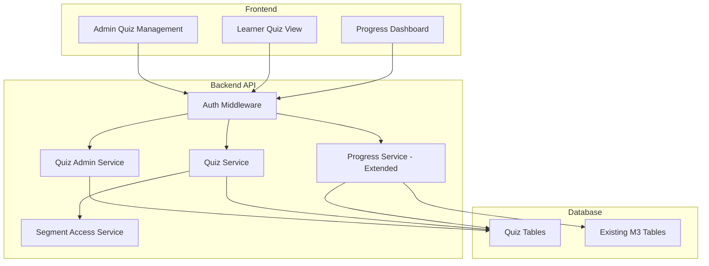
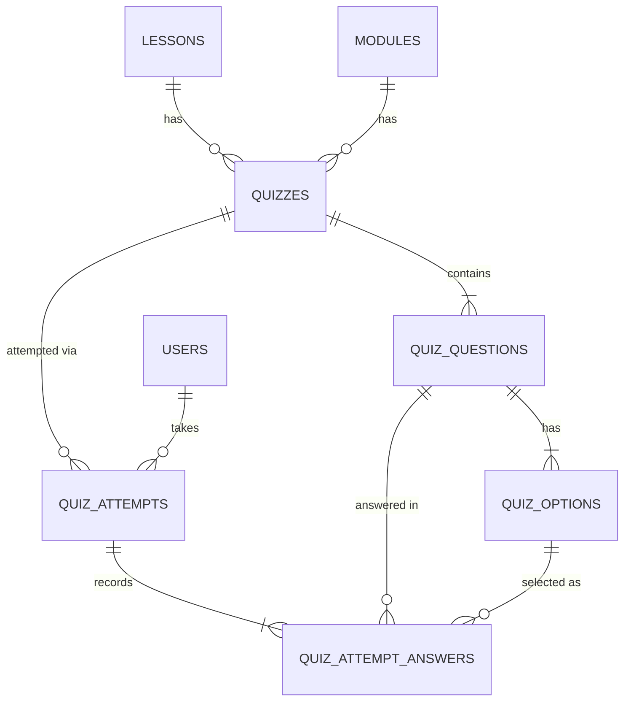

# Design Document

## Overview

### Purpose

This design defines the implementation approach for M4: Quizzes & Progress Tracking. It covers basic multiple-choice quiz functionality (admin CRUD, learner quiz-taking, results display), non-blocking quiz flow, and enhanced progress tracking that includes quiz attempt data alongside existing lesson/module completion from M3.

### Relevant Tech Context

- Monorepo application.
- Frontend: Vite, React, TypeScript, shadcn/ui, Tailwind CSS.
- Backend: Node.js, Express, PostgreSQL, Drizzle ORM.
- Validation: Zod.
- Auth: email/password stored in DB with hashed passwords.
- Emails: Nodemailer.

### Screenshot/Figma Context

Kiro must read `.kiro/context/screenshot-catalog.md` before generating or modifying UI for this milestone.

Relevant screenshot assets:
- `.kiro/context/screenshots/COMPONENTS.png`
- `.kiro/context/screenshots/CONTENT_MANAGEMENT.png`
- `.kiro/context/screenshots/LESSON_VIDEO_and_TEXTSLIDE.png`
- `.kiro/context/screenshots/DASHBOARD_SCREEN.png`
- `.kiro/context/screenshots/STYLE.png`
- `.kiro/context/screenshots/OVERLAY.png`

### Screen and Flow Interpretation

M4 covers basic quizzes and progress tracking.

**Quiz placement:**
- Quiz appears after segment modules in the Segment Content accordion area and can appear in or after lesson content depending on final content flow.
- Admin quiz/question creation appears as part of the Create Segment/content wizard using side-panel/drawer patterns.
- Recent Activity may display quiz pass/fail rows and basic score text, but this must remain lightweight and not become detailed analytics.

**Progress:**
- Progress bars appear on dashboard cards, segment overview rows, learner dashboard, user management list, user profile, and lesson sidebar.
- Status badges must reuse shared variants: Not Started, In Progress, Completed, Overdue, Inactive, Deactivated, Ending Soon, On Track, Expired.

**Quiz behavior:**
- Quizzes are multiple-choice and non-blocking.
- Learners may submit answers and see basic result/score feedback.
- Admins can create/manage quiz questions/options only within MVP quiz scope.

### UI Implementation Instructions To Kiro

- Keep the UI consistent with `.kiro/steering/ui-style-guide.md`, `.kiro/steering/design-system.md`, `.kiro/context/screenshot-catalog.md`, `STYLE.png`, and `OVERLAY.png`.
- Use shadcn/ui primitives where they match the screenshots, but centralize variants in shared components instead of scattering one-off Tailwind classes.
- Preserve the screenshot visual system: Inter typography, teal active states, navy primary actions, white cards, light borders, subtle shadows, rounded corners, status badges, and responsive 4-column/mobile and 12-column/desktop grids.
- Do not invent missing flows. If the SOW requires something not shown in screenshots, implement safe structure and mark the missing UI state as a gap.
- Treat screenshots as UI/UX references, not automatic scope additions.

### Milestone UI/Figma Gaps and Clarifications

- Exact quiz learner screen is not fully shown as a dedicated screen. Use existing card/form/list patterns and mark detailed quiz screen layout as pending if Figma does not provide it.
- Detailed analytics, certificates, and advanced score dashboards are out of scope even if activity rows show scores.
- Quiz lock UI must not mean quiz blocks progression. SOW says quizzes are non-blocking.


## Architecture

### System Context

The quiz system integrates with the existing M3 learning platform as a new module within the monorepo. It adds quiz CRUD capabilities for admins, quiz-taking for learners, and extends the progress tracking service to include quiz attempt data.



### Integration with Existing M3 Services

| Existing Service | M4 Integration |
|---|---|
| Auth Middleware | Reused for all quiz endpoints (JWT verification, role checks) |
| Segment Access Service | Reused to verify learner has access to segment containing the quiz |
| Progress Service | Extended to include quiz attempt summary in progress responses |
| Lesson/Module tables | Referenced via foreign keys from quiz table |
| Navigation Service | Unchanged — quiz data has no effect on progression logic |
| Completion Service | Unchanged — lesson completion independent of quiz status |

### Key Architectural Decisions

1. **Separate quiz module**: Quiz logic lives in `backend/src/modules/quizzes/` with its own controller, service, and schema files. This keeps quiz concerns isolated from lesson/module logic.

2. **Non-blocking by design**: The Navigation Service and Completion Service are NOT modified to check quiz state. The non-blocking invariant is enforced by absence of coupling, not by conditional checks.

3. **Score calculation in service layer**: Score calculation happens in the Quiz Service at submission time, not via database triggers or computed columns. This keeps the logic testable and explicit.

4. **Multi_select exact match**: For multi_select questions, correctness requires the learner's selected options to exactly match all correct options (no partial credit). This simplifies scoring logic.

5. **Progress extension, not replacement**: The existing Progress Service is extended with additional quiz-related fields in its response. Module completion logic remains unchanged (lesson-only).

### Backend Module Structure

```
backend/src/modules/quizzes/
  quiz.controller.ts       — Route handlers (thin)
  quiz.service.ts          — Learner quiz logic (retrieve, submit, score)
  quiz-admin.service.ts    — Admin CRUD logic
  quiz.schema.ts           — Zod validation schemas
  quiz.routes.ts           — Express route definitions
```

### Frontend Module Structure

```
frontend/src/features/
  learning/
    components/
      QuizView.tsx           — Learner quiz-taking component
      QuizResults.tsx        — Results display component
      QuizSection.tsx        — Quiz placement within lesson/module view
  admin/
    components/
      QuizList.tsx           — Admin quiz list
      QuizForm.tsx           — Create/edit quiz form
      QuizDetail.tsx         — Quiz detail with stats
      QuestionBuilder.tsx    — Dynamic question/option builder
```

## Components and Interfaces

### API Endpoints

#### Admin Quiz Endpoints (require admin role)

| Method | Path | Description |
|--------|------|-------------|
| POST | `/api/admin/quizzes` | Create a quiz with questions and options |
| GET | `/api/admin/quizzes` | List all quizzes (supports filtering by lesson_id, module_id) |
| GET | `/api/admin/quizzes/:quizId` | Get quiz detail with questions, options, and stats |
| PUT | `/api/admin/quizzes/:quizId` | Update quiz (title, description, questions, options) |
| DELETE | `/api/admin/quizzes/:quizId` | Delete quiz with cascade (questions, options, attempts) |

#### Learner Quiz Endpoints (require authenticated learner with segment access)

| Method | Path | Description |
|--------|------|-------------|
| GET | `/api/quizzes/:quizId` | Get quiz for taking (no is_correct exposed) |
| POST | `/api/quizzes/:quizId/attempts` | Submit quiz attempt, returns scored result |
| GET | `/api/quizzes/:quizId/attempts` | Get learner's attempt history for a quiz |
| GET | `/api/quizzes/:quizId/attempts/:attemptId` | Get specific attempt detail |

#### Progress Endpoints (extended from M3)

| Method | Path | Description |
|--------|------|-------------|
| GET | `/api/progress/segments/:segmentId` | Segment progress with quiz summary |
| GET | `/api/progress/modules/:moduleId` | Module progress with quiz data |

### Service Interfaces

#### QuizAdminService

```typescript
interface QuizAdminService {
  createQuiz(data: CreateQuizInput): Promise<Quiz>;
  updateQuiz(quizId: string, data: UpdateQuizInput): Promise<Quiz>;
  deleteQuiz(quizId: string): Promise<void>;
  listQuizzes(filters?: QuizFilters): Promise<QuizListItem[]>;
  getQuizDetail(quizId: string): Promise<QuizDetail>;
}
```

#### QuizService

```typescript
interface QuizService {
  getQuizForLearner(quizId: string, userId: string): Promise<LearnerQuiz>;
  submitAttempt(quizId: string, userId: string, answers: SubmitAnswerInput[]): Promise<AttemptResult>;
  getAttemptHistory(quizId: string, userId: string): Promise<AttemptSummary[]>;
  getAttemptDetail(attemptId: string, userId: string): Promise<AttemptDetail>;
}
```

#### ProgressService (extended)

```typescript
interface ProgressService {
  // Existing M3 methods unchanged
  getSegmentProgress(segmentId: string, userId: string): Promise<SegmentProgress>;
  getModuleProgress(moduleId: string, userId: string): Promise<ModuleProgress>;
}

// Extended response types
interface SegmentProgress {
  lessonsCompleted: number;
  lessonsTotal: number;
  modulesCompleted: number;
  modulesTotal: number;
  quizzesAttempted: number;   // NEW
  quizzesTotal: number;       // NEW
}

interface ModuleProgress {
  lessonsCompleted: number;
  lessonsTotal: number;
  isComplete: boolean;          // Based ONLY on lessons
  quizzesAttempted: number;     // NEW
  quizzesTotal: number;         // NEW
  quizBestScores: QuizScore[];  // NEW
}
```

### Frontend Components

#### QuizView (Learner)

- Renders quiz questions with radio buttons (single_select) or checkboxes (multi_select)
- Displays question type indicator ("Select one answer" / "Select all correct answers")
- Shows "Skip Quiz" navigation option
- Handles submission with loading state and error handling
- Displays previous best score with retake option when applicable
- Responsive: card layout at ≥1024px, stacked full-width at <1024px

#### QuizResults (Learner)

- Shows overall score (e.g., "4 out of 5"), percentage
- Per-question breakdown: learner's answer vs correct answer
- Correct/incorrect visual indicators per question

#### QuizForm (Admin)

- Title, description, content association (lesson or module select)
- Dynamic QuestionBuilder for adding/removing questions
- Question type selector (single-select / multi-select)
- Option fields with correct answer marking
- Validation: at least 1 question, at least 2 options per question, correct option constraints

#### QuizList (Admin)

- Table/list of quizzes with title, associated content, question count, attempt count
- Filter by association type (lesson/module)
- Row actions: View, Edit, Delete

## Data Models

### Quiz Tables (Drizzle ORM Schema)

#### quizzes

| Column | Type | Constraints |
|--------|------|-------------|
| id | UUID | Primary key, default gen_random_uuid() |
| title | text | NOT NULL |
| description | text | Nullable |
| lesson_id | UUID | FK → lessons(id), nullable |
| module_id | UUID | FK → modules(id), nullable |
| created_at | timestamp | NOT NULL, default now() |
| updated_at | timestamp | NOT NULL, default now() |

**Constraint:** CHECK (lesson_id IS NOT NULL OR module_id IS NOT NULL)

#### quiz_questions

| Column | Type | Constraints |
|--------|------|-------------|
| id | UUID | Primary key, default gen_random_uuid() |
| quiz_id | UUID | FK → quizzes(id) ON DELETE CASCADE, NOT NULL |
| question_text | text | NOT NULL |
| question_type | enum('single_select', 'multi_select') | NOT NULL, default 'single_select' |
| sort_order | integer | NOT NULL |
| created_at | timestamp | NOT NULL, default now() |
| updated_at | timestamp | NOT NULL, default now() |

**Constraint:** UNIQUE (quiz_id, sort_order)

#### quiz_options

| Column | Type | Constraints |
|--------|------|-------------|
| id | UUID | Primary key, default gen_random_uuid() |
| question_id | UUID | FK → quiz_questions(id) ON DELETE CASCADE, NOT NULL |
| option_text | text | NOT NULL |
| is_correct | boolean | NOT NULL, default false |
| sort_order | integer | NOT NULL |

**Constraint:** UNIQUE (question_id, sort_order)

#### quiz_attempts

| Column | Type | Constraints |
|--------|------|-------------|
| id | UUID | Primary key, default gen_random_uuid() |
| quiz_id | UUID | FK → quizzes(id) ON DELETE CASCADE, NOT NULL |
| user_id | UUID | FK → users(id) ON DELETE CASCADE, NOT NULL |
| score | integer | NOT NULL |
| total_questions | integer | NOT NULL |
| completed_at | timestamp | NOT NULL, default now() |

#### quiz_attempt_answers

| Column | Type | Constraints |
|--------|------|-------------|
| id | UUID | Primary key, default gen_random_uuid() |
| attempt_id | UUID | FK → quiz_attempts(id) ON DELETE CASCADE, NOT NULL |
| question_id | UUID | FK → quiz_questions(id), NOT NULL |
| selected_option_id | UUID | FK → quiz_options(id), NOT NULL |

**Note:** A multi_select question will have multiple rows in this table for the same (attempt_id, question_id) pair — one per selected option.

### Entity Relationship Diagram



### Data Invariants

1. **Association invariant:** Every quiz must reference at least one of lesson_id or module_id (enforced by CHECK constraint).
2. **Sort order uniqueness:** Within a quiz, no two questions share the same sort_order (enforced by UNIQUE constraint). Within a question, no two options share the same sort_order.
3. **Correctness invariant:** Every question must have at least one correct option. Single_select questions must have exactly one. Multi_select questions must have at least two. (Enforced at service/validation layer.)
4. **Score bounds:** For any attempt, 0 ≤ score ≤ total_questions.
5. **Cascade deletion:** Deleting a quiz cascades to questions, options, and attempts.


## Correctness Properties

*A property is a characteristic or behavior that should hold true across all valid executions of a system — essentially, a formal statement about what the system should do. Properties serve as the bridge between human-readable specifications and machine-verifiable correctness guarantees.*

### Property 1: Sort Order Uniqueness Within Quiz

*For any* quiz and any set of questions added to that quiz, the sort_order values assigned to questions SHALL be unique within that quiz — no two questions in the same quiz may share a sort_order value.

**Validates: Requirements 1.10**

### Property 2: Quiz Association Invariant

*For any* quiz creation or update operation, the resulting quiz record SHALL have at least one of lesson_id or module_id set to a non-null value. A quiz with both fields null SHALL be rejected.

**Validates: Requirements 1.11**

### Property 3: Correct Option Constraints by Question Type

*For any* single_select question, there SHALL be exactly one option with is_correct set to true. *For any* multi_select question, there SHALL be at least two options with is_correct set to true. The service SHALL reject question configurations that violate these constraints.

**Validates: Requirements 1.12, 1.12a, 1.12b**

### Property 4: Quiz Creation Round-Trip

*For any* valid quiz creation payload (with title, association, questions, and options), creating the quiz and then retrieving it SHALL return a quiz with matching title, association, and the same number of questions and options with matching content.

**Validates: Requirements 2.1, 2.2**

### Property 5: Correct Answer Never Exposed to Learner

*For any* quiz retrieved via a learner-facing endpoint, the response SHALL NOT contain the is_correct flag on any option. The learner SHALL only see option_text and option_id.

**Validates: Requirements 5.1, 5.8**

### Property 6: Score Calculation Invariant

*For any* quiz attempt submission, the recorded score SHALL equal the count of questions answered correctly, where: for single_select questions, correct means the selected option has is_correct=true; for multi_select questions, correct means the selected options exactly match all options with is_correct=true (no missing, no extra). Unanswered questions SHALL count as incorrect (score 0 for that question).

**Validates: Requirements 5.2, 5.2a, 5.2b, 5.4, 5.9**

### Property 7: Total Questions Consistency

*For any* quiz attempt submission, the total_questions field recorded in the attempt SHALL equal the actual number of questions in the quiz at the time of submission.

**Validates: Requirements 5.10**

### Property 8: Attempt History Ordering

*For any* learner's attempt history for a quiz, the returned list SHALL be ordered by completed_at in descending order (most recent first).

**Validates: Requirements 6.2**

### Property 9: Percentage Calculation Invariant

*For any* quiz attempt result, the percentage score SHALL equal Math.round((score / total_questions) * 100). This holds for all valid score and total_questions values where total_questions > 0.

**Validates: Requirements 6.5, 6.6**

### Property 10: Non-Blocking Progression Invariant

*For any* learner progression eligibility check (lesson completion, module progression, navigation to subsequent content), the determination SHALL be identical regardless of whether the learner has taken any quizzes, how many attempts they have made, or what scores they achieved. Quiz data SHALL have zero effect on progression logic.

**Validates: Requirements 7.1, 7.2, 7.3, 7.4, 7.6, 7.7, 8.3, 8.5, 8.7**

### Property 11: Best Score Selection

*For any* module progress response where the learner has attempted a quiz multiple times, the best_score field SHALL equal the maximum score percentage across all attempts for that quiz.

**Validates: Requirements 8.4**

### Property 12: Attempted Count Bounded Invariant

*For any* progress response (segment or module level), the quizzes_attempted count SHALL be less than or equal to the quizzes_total count within that scope.

**Validates: Requirements 8.8**

## Error Handling

### Quiz-Specific Error Responses

| Error Scenario | HTTP Status | Error Code | Message |
|---|---|---|---|
| Quiz not found | 404 | QUIZ_NOT_FOUND | "Quiz not found" |
| Attempt not found | 404 | ATTEMPT_NOT_FOUND | "Quiz attempt not found" |
| Referenced lesson not found | 404 | LESSON_NOT_FOUND | "Referenced lesson does not exist" |
| Referenced module not found | 404 | MODULE_NOT_FOUND | "Referenced module does not exist" |
| Validation error (Zod) | 400 | VALIDATION_ERROR | Field-specific error messages |
| No questions provided | 400 | VALIDATION_ERROR | "At least one question is required" |
| Fewer than 2 options | 400 | VALIDATION_ERROR | "At least two options are required per question" |
| Single_select: no correct option | 400 | VALIDATION_ERROR | "Exactly one correct option is required for single-select questions" |
| Single_select: multiple correct | 400 | VALIDATION_ERROR | "Exactly one correct option is allowed for single-select questions" |
| Multi_select: fewer than 2 correct | 400 | VALIDATION_ERROR | "At least two correct options are required for multi-select questions" |
| Single_select: multiple selections submitted | 400 | VALIDATION_ERROR | "Only one selection is allowed for single-select questions" |
| Invalid option_id in submission | 400 | VALIDATION_ERROR | "Invalid option reference for question" |
| Learner lacks segment access | 403 | ACCESS_DENIED | "You do not have access to this content" |
| Non-admin accessing admin endpoint | 403 | FORBIDDEN | "Admin access required" |
| Unauthenticated request | 401 | UNAUTHORIZED | "Authentication required" |

### Error Handling Strategy

1. **Validation errors** (Zod): Return 400 with structured field-level errors. Validate at the controller layer before reaching the service.

2. **Not found errors**: Service layer throws a typed NotFoundError. Controller catches and returns 404 with appropriate error code.

3. **Authorization errors**: Auth middleware returns 401/403 before reaching controller. Segment access checks happen in the service layer and throw AccessDeniedError.

4. **Database constraint violations**: Catch unique constraint violations (sort_order) and FK violations at the service layer. Return appropriate 400/404 responses rather than exposing raw database errors.

5. **Unexpected errors**: Global error handler catches unhandled exceptions, logs them, and returns a generic 500 response without leaking internal details.

### Frontend Error Handling

- Display user-friendly error messages from API error responses.
- Show inline validation errors on form fields before submission.
- Show toast/banner for submission failures with retry option.
- Handle network errors gracefully with "Unable to connect" messaging.
- Prevent duplicate submissions via loading state on submit buttons.

## Testing Strategy

### Property-Based Testing

This feature is suitable for property-based testing because it contains pure scoring logic, data invariants, and universal properties that hold across a wide input space.

**Library:** [fast-check](https://github.com/dubzzz/fast-check) (TypeScript property-based testing library)

**Configuration:** Minimum 100 iterations per property test.

**Tag format:** `Feature: m4-quizzes-progress-tracking, Property {number}: {property_text}`

Properties to implement as property-based tests:
- Property 1: Sort order uniqueness (generate random question sets, verify uniqueness enforced)
- Property 2: Quiz association invariant (generate random quiz payloads, verify null-null rejected)
- Property 3: Correct option constraints (generate random option configurations by type, verify constraints)
- Property 5: is_correct never exposed (generate random quizzes, retrieve as learner, verify absence)
- Property 6: Score calculation invariant (generate random quizzes + random answers, verify score)
- Property 7: Total questions consistency (generate random quiz sizes, verify total_questions field)
- Property 9: Percentage calculation (generate random score/total pairs, verify formula)
- Property 10: Non-blocking invariant (generate random progression scenarios with/without quiz data, verify identical results)
- Property 12: Attempted count bounded (generate random attempt scenarios, verify count ≤ total)

### Unit Testing (Example-Based)

Unit tests cover specific scenarios, edge cases, and integration points:

**Admin CRUD:**
- Create quiz with valid data → success
- Create quiz with missing title → 400
- Create quiz with non-existent lesson_id → 404
- Update quiz: add/remove/modify questions
- Delete quiz: cascade verification
- Non-admin access → 403

**Learner Quiz Taking:**
- Submit with all correct answers → full score
- Submit with all incorrect → zero score
- Submit partial (skip questions) → unanswered scored as incorrect
- Single_select with multiple selections → 400
- Invalid option_id → 400
- Retake creates new attempt record

**Results Display:**
- Result includes score, total, percentage, per-question breakdown
- Empty attempt history returns empty list
- Attempt detail includes correct answer indication

**Progress:**
- Module completion unaffected by quiz state
- Best score correctly identified from multiple attempts
- Segment quiz statistics aggregation

### Integration Testing

- Full API flow: create quiz → take quiz → view results → view progress
- Auth middleware enforcement on all endpoints
- Segment access checks for learner endpoints
- Database constraint enforcement (FK, unique, check)
- Cascade deletion verification

### Frontend Testing

- Component rendering: radio for single_select, checkbox for multi_select
- Responsive layout breakpoints (1024px threshold)
- Loading state during submission
- Error display on API failure
- Skip quiz navigation
- Previous score display with retake option
- Admin form validation (client-side)

## Backend Design Notes

- Quiz result storage should support basic answer history without detailed analytics.
- Progress calculation should be deterministic and based on completed lessons and quiz attempts where applicable.
- Quiz UI states must use shared card/form/button/badge patterns from screenshots.
- Do not implement certificates or detailed scoring dashboards.

## API Design Rules

- Use Express route modules by feature.
- Validate request bodies and params with Zod.
- Enforce authentication on protected routes.
- Enforce admin access on admin routes.
- Enforce learner assignment and segment access checks on learner routes.
- Use consistent response shapes and error codes.
- Keep controllers thin and business logic in services.

## Frontend Design Rules

- Use shared service/API client hooks for data access.
- Use reusable layout shells for admin and learner areas.
- Use shared components for Button, FormField, Select/Dropdown, StatusBadge, Card, ActionMenu, SuccessModal, Sidebar, ProgressBar, and SegmentAccordion.
- Keep loading, empty, disabled, and error states visually consistent with the screenshot catalog.
- Mobile screens must be intentionally designed as stacked cards/drawers, not compressed desktop tables.
