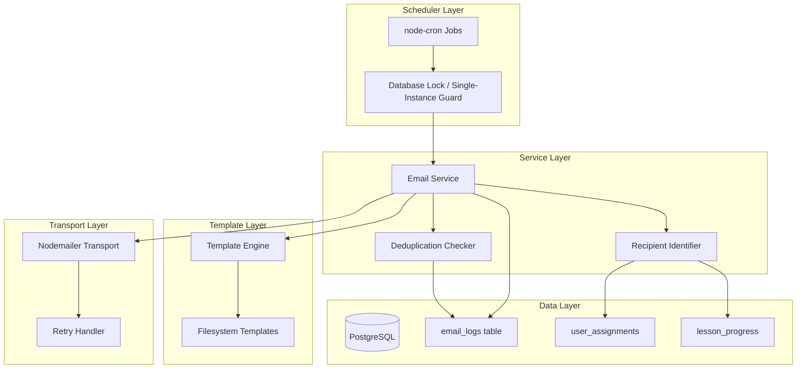

# Design Document

## Overview

This design defines the implementation approach for Milestone 5: Email Notifications & Final Delivery. M5 completes the Rhose learning platform MVP by implementing automated email notification flows (weekly segment-related and monthly post-completion), integrating client-provided email templates, ensuring email deduplication and tracking, and producing a deployment-ready build with comprehensive QA coverage across all milestones (M1–M5).

### Purpose

Email notifications keep learners engaged during active segment access (weekly) and after segment completion (monthly). The system uses cron-based scheduling, Nodemailer transport, filesystem-based templates, and a deduplication layer backed by the `email_logs` table to guarantee idempotent delivery.

### Relevant Tech Context

- Monorepo application.
- Frontend: Vite, React, TypeScript, shadcn/ui, Tailwind CSS.
- Backend: Node.js, Express, PostgreSQL, Drizzle ORM.
- Validation: Zod.
- Auth: email/password stored in DB with hashed passwords.
- Emails: Nodemailer.

### Screenshot/Figma Context

Kiro must read `.kiro/context/screenshot-catalog.md` before generating or modifying UI for this milestone.

Relevant screenshot assets:
- `.kiro/context/screenshots/STYLE.png` — Global visual tokens, typography, spacing.
- `.kiro/context/screenshots/OVERLAY.png` — Button variants, input states, modal patterns.
- Existing success modal/status patterns from `USER_MANAGMENT_SCREENS.png` and `CONTENT_MANAGEMENT.png` where admin confirmation UI is needed.

### Screen and Flow Interpretation

M5 covers email notification backend flows, QA, and deployment readiness.

There is **no standalone email notification UI screenshot**. Use existing modal/status patterns only for admin confirmations if a manual QA or trigger confirmation screen is needed.

Relevant visual reuse:
- Success modal/card with green check, bold title, helper text, and navy action button.
- Status badges and logs/lists should use the same admin card/table/list patterns as M2.
- No custom email template design should be created in the app UI. Email templates are client-provided.

### UI Implementation Instructions To Kiro

- Keep the UI consistent with `.kiro/steering/ui-style-guide.md`, `.kiro/steering/design-system.md`, `.kiro/context/screenshot-catalog.md`, `STYLE.png`, and `OVERLAY.png`.
- Use shadcn/ui primitives where they match the screenshots, but centralize variants in shared components instead of scattering one-off Tailwind classes.
- Preserve the screenshot visual system: Inter typography, teal active states, navy primary actions, white cards, light borders, subtle shadows, rounded corners, status badges, and responsive 4-column/mobile and 12-column/desktop grids.
- Do not invent missing flows. If the SOW requires something not shown in screenshots, implement safe structure and mark the missing UI state as a gap.
- Treat screenshots as UI/UX references, not automatic scope additions.

### Milestone UI/Figma Gaps and Clarifications

- Email template files/content must be supplied by the client.
- If manual email test/trigger UI is requested, it is not clearly in SOW and should be confirmed before implementation.
- CRM/external integrations and custom email design remain out of scope.

## Architecture

The email notification system follows a layered architecture with clear separation between scheduling, business logic, template rendering, and transport.



### Key Architectural Decisions

1. **Cron-based scheduling** using `node-cron` — lightweight, runs in-process, configurable via environment variables. No external job queue needed for MVP scale.

2. **Single-instance execution** — A database advisory lock (or a `scheduler_locks` row-level lock) prevents concurrent execution of the same job type across multiple server instances.

3. **Idempotent delivery** — The `email_logs` table with a deduplication window check ensures that re-running a job (e.g., after a crash recovery) never sends duplicate emails.

4. **Sequential batch processing** — Emails are sent one at a time with a configurable inter-send delay to respect SMTP rate limits.

5. **Retry with exponential backoff** — Failed SMTP sends are retried up to 3 times (1s, 2s, 4s) before recording a failure.

6. **Template separation** — Templates live on the filesystem, loaded at send time. No database storage of template content. Subject lines are configured per template type via environment variables.

## Components and Interfaces

### Email Scheduler (`backend/src/modules/emails/email-scheduler.ts`)

```typescript
interface EmailSchedulerConfig {
  weeklyCron: string;       // e.g., "0 9 * * 1" (Monday 9am UTC)
  monthlyCron: string;      // e.g., "0 9 1 * *" (1st of month 9am UTC)
}

interface EmailScheduler {
  start(): void;
  stop(): void;
  runWeeklyJob(): Promise<JobResult>;
  runMonthlyJob(): Promise<JobResult>;
}

interface JobResult {
  jobType: "weekly" | "monthly";
  startedAt: Date;
  completedAt: Date;
  eligibleCount: number;
  sentCount: number;
  skippedCount: number;
  failedCount: number;
}
```

### Email Service (`backend/src/modules/emails/email-service.ts`)

```typescript
interface EmailService {
  sendWeeklyEmails(): Promise<JobResult>;
  sendMonthlyEmails(): Promise<JobResult>;
  sendEmail(recipient: EmailRecipient, templateType: TemplateType, variables: TemplateVariables): Promise<SendResult>;
}

interface EmailRecipient {
  userId: string;
  email: string;
  name: string;
  segmentId: string;
  segmentTitle: string;
}

type TemplateType = "weekly_segment" | "monthly_general";

interface TemplateVariables {
  user_name: string;
  segment_title: string;
  current_progress_percentage?: string;
  completion_date?: string;
  platform_login_url: string;
}

type SendResult = { status: "sent" } | { status: "skipped"; reason: string } | { status: "failed"; error: string };
```

### Recipient Identifier (`backend/src/modules/emails/recipient-identifier.ts`)

```typescript
interface RecipientIdentifier {
  getWeeklyRecipients(): Promise<EmailRecipient[]>;
  getMonthlyRecipients(): Promise<EmailRecipient[]>;
}
```

- **Weekly recipients**: Users with at least one active assignment where segment status is "active" AND (access_duration_days is null OR current date ≤ assigned_at + access_duration_days).
- **Monthly recipients**: Users who have completed all lessons in all modules of an assigned segment.

### Deduplication Checker (`backend/src/modules/emails/deduplication-checker.ts`)

```typescript
interface DeduplicationChecker {
  hasBeenSent(userId: string, segmentId: string, emailType: TemplateType, windowDays: number): Promise<boolean>;
  hasFailed(userId: string, segmentId: string, emailType: TemplateType, windowDays: number): Promise<boolean>;
}
```

### Template Engine (`backend/src/modules/emails/template-engine.ts`)

```typescript
interface TemplateEngine {
  render(templateType: TemplateType, variables: TemplateVariables): Promise<RenderedEmail>;
}

interface RenderedEmail {
  html: string;
  text: string;
  subject: string;
}
```

- Loads templates from `EMAIL_TEMPLATE_DIR` environment variable path.
- Interpolates `{{variable_name}}` placeholders.
- Unresolved placeholders are replaced with empty string + warning logged.
- Subject lines come from `WEEKLY_EMAIL_SUBJECT` and `MONTHLY_EMAIL_SUBJECT` env vars.

### Health Endpoint (`backend/src/modules/health/health-controller.ts`)

```typescript
// GET /health
interface HealthResponse {
  status: "ok" | "degraded" | "error";
  timestamp: string;
  services: {
    database: "connected" | "disconnected";
    emailTransport: "connected" | "disconnected";
    scheduler: "running" | "stopped";
  };
}
```

### API Design Rules (Preserved)

- Use Express route modules by feature.
- Validate request bodies and params with Zod.
- Enforce authentication on protected routes.
- Enforce admin access on admin routes.
- Enforce learner assignment and segment access checks on learner routes.
- Use consistent response shapes and error codes.
- Keep controllers thin and business logic in services.

### Frontend Design Rules (Preserved)

- Use shared service/API client hooks for data access.
- Use reusable layout shells for admin and learner areas.
- Use shared components for Button, FormField, Select/Dropdown, StatusBadge, Card, ActionMenu, SuccessModal, Sidebar, ProgressBar, and SegmentAccordion.
- Keep loading, empty, disabled, and error states visually consistent with the screenshot catalog.
- Mobile screens must be intentionally designed as stacked cards/drawers, not compressed desktop tables.

## Data Models

### email_logs Table

```sql
CREATE TABLE email_logs (
  id UUID PRIMARY KEY DEFAULT gen_random_uuid(),
  user_id UUID NOT NULL REFERENCES users(id) ON DELETE CASCADE,
  segment_id UUID NOT NULL REFERENCES segments(id) ON DELETE CASCADE,
  email_type VARCHAR(20) NOT NULL CHECK (email_type IN ('weekly', 'monthly')),
  sent_at TIMESTAMP WITH TIME ZONE NOT NULL DEFAULT NOW(),
  delivery_status VARCHAR(10) NOT NULL CHECK (delivery_status IN ('sent', 'failed')),
  error_details TEXT,
  created_at TIMESTAMP WITH TIME ZONE NOT NULL DEFAULT NOW()
);

-- Deduplication index: prevents duplicate sends within a time window
-- Application-level check uses this index for fast lookups
CREATE INDEX idx_email_logs_dedup 
  ON email_logs (user_id, segment_id, email_type, sent_at);

-- Query optimization for recipient identification
CREATE INDEX idx_email_logs_window_check 
  ON email_logs (user_id, segment_id, email_type, delivery_status, sent_at);
```

### Drizzle ORM Schema (`backend/src/db/schema/email-logs.ts`)

```typescript
import { pgTable, uuid, varchar, timestamp, text, index, check } from "drizzle-orm/pg-core";
import { users } from "./users";
import { segments } from "./segments";

export const emailLogs = pgTable("email_logs", {
  id: uuid("id").primaryKey().defaultRandom(),
  userId: uuid("user_id").notNull().references(() => users.id, { onDelete: "cascade" }),
  segmentId: uuid("segment_id").notNull().references(() => segments.id, { onDelete: "cascade" }),
  emailType: varchar("email_type", { length: 20 }).notNull(),
  sentAt: timestamp("sent_at", { withTimezone: true }).notNull().defaultNow(),
  deliveryStatus: varchar("delivery_status", { length: 10 }).notNull(),
  errorDetails: text("error_details"),
  createdAt: timestamp("created_at", { withTimezone: true }).notNull().defaultNow(),
}, (table) => ({
  dedupIndex: index("idx_email_logs_dedup").on(table.userId, table.segmentId, table.emailType, table.sentAt),
  windowCheckIndex: index("idx_email_logs_window_check").on(table.userId, table.segmentId, table.emailType, table.deliveryStatus, table.sentAt),
}));
```

### Data Model Notes (Preserved)

Kiro should update or create Drizzle schema definitions only where required by this milestone.

General entities that may be involved:
- users
- password reset tokens
- segments
- modules
- lessons
- segment assignments
- lesson progress
- quizzes, quiz questions, quiz options, quiz responses
- email_logs (new for M5)

Only add tables needed for this milestone. Do not overbuild future milestone models unless required as a dependency.

## Correctness Properties

*A property is a characteristic or behavior that should hold true across all valid executions of a system — essentially, a formal statement about what the system should do. Properties serve as the bridge between human-readable specifications and machine-verifiable correctness guarantees.*

### Property 1: Weekly Recipient Identification Correctness

*For any* set of users with segment assignments, the weekly email recipient list SHALL contain exactly those user-segment pairs where: (a) the segment status is "active", AND (b) the assignment is within access duration (access_duration_days is null OR current_date ≤ assigned_at + access_duration_days). No expired assignments or non-active segments shall produce recipients.

**Validates: Requirements 1.2, 1.3, 1.8, 1.9**

### Property 2: Monthly Recipient Identification Correctness

*For any* set of users with segment assignments and lesson progress records, the monthly email recipient list SHALL contain exactly those user-segment pairs where the user has completed all lessons in all modules of the assigned segment. Users with incomplete progress shall be excluded.

**Validates: Requirements 2.2, 2.7**

### Property 3: Email Deduplication Idempotence

*For any* user-segment pair and email type (weekly or monthly), sending the same email multiple times within the deduplication window (7 days for weekly, 30 days for monthly) SHALL result in exactly one Email_Log record with delivery_status "sent". Subsequent attempts within the window are skipped.

**Validates: Requirements 1.5, 2.4, 5.4, 5.6**

### Property 4: Template Interpolation Round-Trip

*For any* valid set of template variables (user_name, segment_title, current_progress_percentage or completion_date, platform_login_url), rendering a template with those variables SHALL produce output that contains each provided variable value in the rendered HTML. No provided value shall be lost during interpolation.

**Validates: Requirements 3.3, 3.4, 3.9**

### Property 5: Unresolved Placeholder Graceful Handling

*For any* template containing placeholder variables that are not present in the provided variable map, the Template_Engine SHALL replace each unresolved placeholder with an empty string. The rendered output shall contain no raw placeholder syntax (e.g., no `{{undefined_var}}` in output).

**Validates: Requirements 3.6**

### Property 6: Retry Behavior with Exponential Backoff

*For any* email send attempt where the SMTP transport fails, the Email_Service SHALL retry up to 3 times with delays following the pattern (1s, 2s, 4s). For N failures where N ≤ 3, exactly N retries occur before either succeeding or recording a final failure. The total retry count never exceeds 3 regardless of failure type.

**Validates: Requirements 4.4, 4.5**

## Error Handling

### Email Delivery Failures

| Scenario | Behavior |
|----------|----------|
| SMTP connection timeout | Retry up to 3 times with exponential backoff (1s, 2s, 4s) |
| SMTP authentication failure | Log error, skip all sends for this batch, alert via application logs |
| Individual send failure (after retries) | Record `delivery_status: "failed"` with error details, proceed to next recipient |
| Batch processing error | Log error with full context, scheduler continues running |

### Template Errors

| Scenario | Behavior |
|----------|----------|
| Template file missing | Log error, skip email dispatch for that template type, scheduler continues |
| Unresolved variable placeholder | Replace with empty string, log warning with placeholder name |
| Template read I/O error | Log error, skip dispatch, scheduler continues |
| Invalid HTML in template | Send as-is (client-provided content is trusted) |

### Scheduler Errors

| Scenario | Behavior |
|----------|----------|
| Unhandled error during job execution | Log error with full stack trace and context, scheduler process continues |
| Database lock acquisition failure | Skip job execution for this cycle, log warning, retry next scheduled time |
| Database connection loss during job | Abort current batch gracefully, log error, scheduler remains registered |

### Startup Errors

| Scenario | Behavior |
|----------|----------|
| SMTP connectivity check fails | Log warning, application starts (emails will fail at send time) |
| Missing required env vars | Application refuses to start, logs which vars are missing |
| Template directory not found | Log warning at startup, emails will fail gracefully at send time |
| Database migration failure | Application refuses to start |

### Deduplication Edge Cases

| Scenario | Behavior |
|----------|----------|
| Previous send recorded as "failed" | Allow resend attempt (failed records don't block retries) |
| Previous send recorded as "sent" | Skip send, log deduplication event |
| Race condition (concurrent sends) | Database index + application-level check prevents duplicates |

## Testing Strategy

### Unit Tests

**Recipient Identification:**
- Weekly: Verify only active assignments with non-expired access duration are included
- Weekly: Verify draft/archived segments are excluded
- Weekly: Verify one email per active assignment per user
- Monthly: Verify only users with full segment completion are included
- Monthly: Verify incomplete progress excludes user-segment pairs

**Deduplication Logic:**
- Verify "sent" record within window blocks resend
- Verify "failed" record within window allows resend
- Verify records outside window do not block new sends
- Verify window calculation for both 7-day and 30-day periods

**Template Rendering:**
- Verify all variables are interpolated correctly for weekly template
- Verify all variables are interpolated correctly for monthly template
- Verify unresolved placeholders become empty strings
- Verify missing template file returns error without crash
- Verify HTML content passes through correctly

**Retry Logic:**
- Verify exponential backoff timing (1s, 2s, 4s)
- Verify max 3 retries
- Verify success on retry N stops further retries
- Verify all retries exhausted records failure

**Health Endpoint:**
- Verify returns 200 with correct JSON shape
- Verify reports database connectivity status
- Verify reports email transport status

### Property-Based Tests

Property-based testing is appropriate for this feature because the core logic involves pure functions (recipient filtering, template interpolation, deduplication checks) with large input spaces (many users, segments, assignment states, variable values).

**Library:** [fast-check](https://github.com/dubzzz/fast-check) (TypeScript PBT library)

**Configuration:** Minimum 100 iterations per property test.

Each property test references its design document property:

- **Feature: m5-email-notifications-final-delivery, Property 1: Weekly recipient identification correctness** — Generate random user/assignment/segment states, verify recipient list matches expected filtering rules.
- **Feature: m5-email-notifications-final-delivery, Property 2: Monthly recipient identification correctness** — Generate random progress states, verify only fully-completed user-segment pairs are returned.
- **Feature: m5-email-notifications-final-delivery, Property 3: Email deduplication idempotence** — Generate random send attempts within/outside windows, verify exactly one "sent" record per window.
- **Feature: m5-email-notifications-final-delivery, Property 4: Template interpolation round-trip** — Generate random valid variable maps, verify all values appear in rendered output.
- **Feature: m5-email-notifications-final-delivery, Property 5: Unresolved placeholder graceful handling** — Generate templates with random unresolved placeholders, verify none remain in output.
- **Feature: m5-email-notifications-final-delivery, Property 6: Retry behavior with exponential backoff** — Generate random failure sequences, verify retry count and timing.

### Integration Tests

- Full email send flow with mocked SMTP (Nodemailer createTestAccount or ethereal.email)
- Scheduler job execution end-to-end with test database
- Health endpoint with real database connection
- Cross-milestone API endpoint verification (M1–M5 endpoints, positive and negative cases)
- Authentication flow tests (login, forgot password, token validation)
- Segment access control and duration enforcement tests
- Lesson completion and progress tracking tests

### Coverage Target

- Minimum 80% line coverage across service modules
- All service-layer business logic functions covered
- Coverage report generated on test completion

### Backend Design Notes (Preserved)

- Email templates are client-provided.
- Use Nodemailer for sending emails unless final infrastructure says otherwise.
- No CRM/external integration or custom email design should be added.
- QA should verify all milestone acceptance criteria.
- Email scheduling and deduplication should be safe, idempotent, and configurable.
